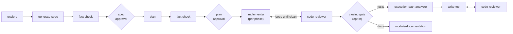
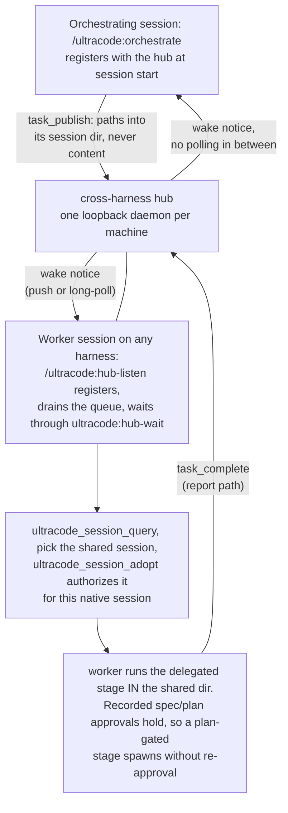
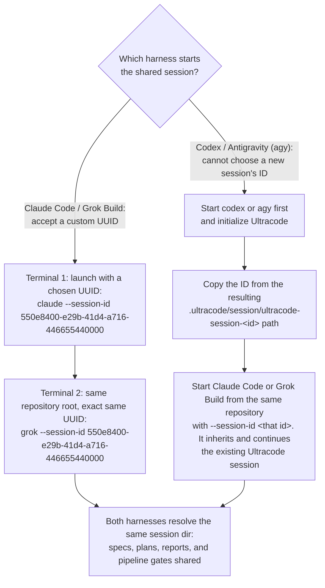

# Ultracode

Ultracode turns a one-shot coding request into a full engineering pipeline. A set of specialist subagents
explore the repo, write a spec, plan the work, implement it, and review it. When you ask for it, they also
trace execution paths, write tests, review again, and update documentation. Every stage follows your repo's
own conventions. One cheap prompt becomes many focused ones. You spend more tokens and get correctness,
coverage, and code that matches how your team already writes.

## Why Ultracode?

The name is borrowed, and I like it. Before it was a plugin, it was a pile of workflows I rebuilt for every
project I touched. All of them came out of the same problems: a startup job where one person manages several
projects at once, on deadlines nobody sane agreed to.

- **Project and client management by vibes.** One person in charge, many projects, all urgent, no process
  holding any of it.
- **Zero documentation from day one.** Almost every project I worked on ran this way. There was no time to
  write anything down, and that is exactly what hurts later, when the project has to be handed to another
  developer or to the client.
- **Coupling.** Multiple moving parts means remembering to mirror a change everywhere it lands. On a big
  change you will forget one, no matter how well you planned.
- **Overlooking.** Most planning failures are a component nobody remembered. As the single person in charge
  of everything, you cannot hold all of it in your head.
- **Idea testing and fact checks.** Before you build, you should check what the system already does and
  where it technically cannot go. That takes time, and startups do not grant it.
- **Guardrails and auditing.** Especially with the cheaper models. You want the changes audited, and audited
  where you can see it, not a model hallucinating its way through the codebase. Your tokens are an asset.
  Spend them responsibly.

## Does it fix all that?

As much as software can. The pipeline exists to make building and idea-testing fast, and to make failure
happen early. If something is going to fail, it should fail now, not three phases later.

The other half is going AFK. The design lets you leave the subagents running and come back to finished work
instead of babysitting a terminal from 9 to 5. That only works if the pipeline is tight enough that the
model does not hallucinate on badly injected context.

## When should I use it?

- **When the codebase is big enough that controlling it hurts.** Multi-module, multi-repo, or old enough that
  nobody holds the whole map anymore.
- **When the deadline for a big feature is unrealistic.** The kind where planning is the part you would skip.
- **When you want the smartest and the cheapest model on each job** without typing "use model X for
  implementing" into every prompt.

When not to use it is covered [further down](#how-much-does-it-actually-cost-in-a-real-world-task), after
you have seen the bill.

## What's in the box

Aimed at serious developers. Tested on real repos, not on benchmarks.

**An orchestrator.** A pipeline is only as good as the thing routing it. The orchestrator derives the session
directory, hands each subagent a self-contained prompt, reads the report that comes back, and decides what
runs next. It is the only entry point and the only router. Nothing else spawns anything.

**Subagents**, one job each. Each is spawned with the skills your repo's inventory says apply, so its output
follows your conventions instead of a framework's defaults:

| Agent | What it's for |
| --- | --- |
| `explore` | Fact-checks your requirements against the repo and adds suggestions from its own research. Anything the repo does not already use is looked up on the web and cited, never recalled from memory. |
| `generate-spec` · `plan` | Turn the request into one spec, then into a phased plan the implementers follow. |
| `fact-check` | Finds hallucinations in specs and plans before either reaches you for approval, so nobody downstream gets false instructions. Its `PASS` is what unlocks the approval gate. |
| `implementer` · `write-test` | Build your requirements and cover them with tests. |
| `code-reviewer` | Checks that the implementers did the right thing and stops them going off track. Loops until clean. |
| `execution-path-analyzer` | Enumerates the branches first, so tests are written against real paths instead of guesses. |
| `module-documentation` | Writes a short description of how each area works, refreshed as the final step. |
| `prompt-generation` | Writes prompts that follow a chain-of-thought structure, for when the thing you are building is itself an agent. |

How they run end to end: approval gates on the spec and the plan, a review loop per phase, and tests and docs
only on request. The full picture, with what enforces each gate, is in [Architecture](docs/architecture.md).



**Model router.** Runs each subagent on the most cost-effective model for its job. See
[Model routing](docs/model-routing.md).

**A cross-harness hub.** One loopback HTTP MCP daemon per machine. It lets your interactive sessions on
different harnesses message each other and hand each other tasks. A task carries paths into the shared
session directory, not copied context. Delegate a phase to the harness best suited for it and hand the wait
to a cheapest-tier subagent that returns when the result lands. No third-party model proxy, no polling in
the session. See
[The cross-harness hub](docs/hub.md).

**Tools and hooks.** Strict guardrails that stop the subagents from going off track, plus tools that let them
record and recall lessons, the way a human team would.

## Documentation

- [Philosophy](docs/philosophy.md)
- [Installation](docs/installation.md)
- [Architecture](docs/architecture.md)
- [Agents](docs/agents.md)
- [Harness limitations](docs/harness-limitations.md)
- [Model routing](docs/model-routing.md)
- [The cross-harness hub](docs/hub.md)
- [Tested models](docs/tested-models.md)
- [Definition authoring](docs/definitions.md)
- [Extending & publishing](docs/extending.md)

## Install

Requires Node 22.5+ and the CLI for each harness you install.

```bash
# Install for every harness
curl -fsSL https://raw.githubusercontent.com/diepquynh/ultracode/main/install.sh | bash

# Claude Code only
curl -fsSL https://raw.githubusercontent.com/diepquynh/ultracode/main/install.sh | bash -s -- claude

# Grok Build only
curl -fsSL https://raw.githubusercontent.com/diepquynh/ultracode/main/install.sh | bash -s -- grok

# Codex only
curl -fsSL https://raw.githubusercontent.com/diepquynh/ultracode/main/install.sh | bash -s -- codex

# Antigravity CLI only
curl -fsSL https://raw.githubusercontent.com/diepquynh/ultracode/main/install.sh | bash -s -- antigravity
```

Uninstall with the same harness argument. The default `all` unregisters every harness and removes the
checkout:

```bash
curl -fsSL https://raw.githubusercontent.com/diepquynh/ultracode/main/uninstall.sh | bash
```

See [Installation](docs/installation.md) for manual installation and uninstall.

## Usage

| Action | Claude Code | Grok Build | Codex | Antigravity |
| --- | --- | --- | --- | --- |
| Initialize the current repository | `/init-kit` | `/init-kit` | `$init-kit` | `/init-kit` |
| Explicitly activate the pipeline router | `/ultracode:orchestrate` | `/ultracode:orchestrate` | `$orchestrate` | `/ultracode:orchestrate` |
| Explicitly activate the prompt-authoring standard | `/ultracode:meta-author` | `/ultracode:meta-author` | `$meta-author` | `/ultracode:meta-author` |
| Toggle unattended autonomy (YOLO) for a session | `/ultracode:yolo on\|off\|status` | `/ultracode:yolo on\|off\|status` | `$yolo on\|off\|status` | `/ultracode:yolo on\|off\|status` |
| Invoke a generated project skill | `/<skill-name>` | `/<skill-name>` | `$<skill-name>` | `/<skill-name>` |
| Reload newly generated project skills | `/reload-plugins` or restart | Press `r` in `/plugins` or start a new session | Start a new session | Restart agy session |
| Runtime inventory and profile | `.ultracode/` | `.ultracode/` | `.ultracode/` | `.ultracode/` |
| Generated project skills | `.claude/skills/` | `.grok/skills/` | `.agents/skills/` | `.agents/skills/` |

Generated Ultracode artifacts can be committed to your repository (except session artifacts), so handover
and moving to a new machine need no extra work.

## Use multiple harnesses in one Ultracode session

An Ultracode session is its artifact directory: `.ultracode/session/ultracode-session-<id>`, holding the
specs, plans, reports, and pipeline gates. It is not any harness's chat history. Any harness that resolves
that directory can carry the pipeline forward. So a frontier-model harness can handle exploration, planning,
and spec generation, then hand implementation to a cheaper harness that is still good at coding, without
copying artifacts or starting a second Ultracode run.

There are two ways to get a second harness into a session. The [cross-harness hub](docs/hub.md) is the
primary path. Launching both harnesses with the same native session ID is the manual fallback for when you
would rather not run the hub daemon.

### With the hub: adopt the session

Open a session on the harness you want doing the work and run `/ultracode:hub-listen`. The orchestrating
session publishes tasks to it and gets woken when they complete. No session IDs are copied anywhere. The
worker discovers the shared session through the hub and adopts it with `ultracode_session_adopt`, which
authorizes the worker's own native session to work inside a session directory it did not create.



Because adoption is authorized by the hub rather than inherited from an ID, it also covers what the
shared-ID trick never could: Codex and Antigravity joining a session they did not start, and resume. A
session whose original harness broke is still listed by `ultracode_session_query`, so another harness adopts
it by ID and continues from its recorded stage. Add a `harnesses` block to `repo-profile.json` and the
orchestrator decides per stage whether to spawn locally or publish a hub task. See the Harness routing
section of [the hub docs](docs/hub.md).

### Without the hub: share the native session ID

Ultracode derives the session directory from the harness's native session ID, so two harnesses launched from
the same repository with the same ID resolve the same directory. The setup depends on whether the harness
that starts the session can choose its own ID:



Claude Code and Grok Build require the supplied value to be a valid UUID. When reopening a conversation that
already exists in that harness, use its `--resume <id>` option instead of `--session-id`.

### Either way

Hand ownership over at clear phase boundaries and tell the receiving harness to continue from the existing
approved spec or plan. Do not run the same phase against the same repo from two harnesses at once. They share
both the working tree and the session state. See
[How the agents communicate](docs/architecture.md#how-the-agents-communicate) for the session layout.

## How much does it actually cost in a real-world task?

Well.... :")


This is a single session on a multi-repo task, with Opus 4.8 as the orchestrator model. The working repos
were a multi-module Java backend, a FastAPI backend, and a React Native mobile app. The session involved 3
iterations of plan reviews and re-exploration.

The rest of the implementation? I let it run and went to sleep, then woke up the following day to review the
code, run manual regression tests, and plan the migration :")

When I wrote this README and created this kit, I was on the Claude Max 5x plan.

Two disclaimers. **This is not for vibe coding.** Prompt-and-pray and your quota runs dry long before you
have a working MVP. **And it is not for a blank slate.** Ultracode matches your repo's existing patterns, so
a fresh `git init` gives it nothing to work with. Bring a real task and a real repo. :")

## Going against the crowd, for now

Everyone else is racing to spend fewer tokens. We spend more, on purpose, because that is today's honest
price for a change that is actually reviewed and tested. "On purpose" is not "forever". Next we want the cost
down without losing the fan-out's reactivity and quality. :")
