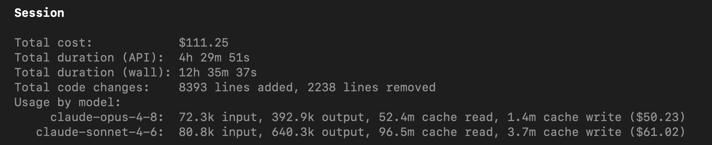

# Ultracode

Ultracode turns a one-shot coding request into a full end-to-end engineering pipeline: a fleet of specialist
subagents that explore, plan, implement and review — then, when you ask for it, trace execution paths, test,
review again, and document — every stage grounded in your repo's own conventions. One cheap prompt becomes
many deliberate ones, and you trade tokens for correctness, coverage, and code that matches how your team
already writes.

## Why Ultracode?

The name is stolen, deliberately — but I like it. Before it was a plugin, it was just a pile of workflows I
rebuilt for every project I touched, and all of them came out of the same frustrations: a startup job where one
person manages several projects at once, on deadlines nobody sane agreed to.

- **Project and client management by vibes.** One PIC, many projects, all urgent, no process holding any of it.
- **Zero documentation from day one.** Almost every project I worked on ran this way — too rushed to write
  anything down, which is exactly what hurts later, when the thing has to be handed over to another dev or to
  the client.
- **Coupling.** Multiple moving parts means remembering to mirror a change everywhere it lands. On a big change
  you *will* forget one, no matter how well you planned.
- **Overlooking.** Most planning failures are just a component nobody remembered. As the single PIC for
  everything, you can't hold all of it in your head.
- **Idea testing and fact checks.** Before you build, you should check what the system already does and where it
  technically can't go. That takes time, and startups don't grant it — businessmen are greedy as hell.
- **Guardrails and auditing.** Especially with the cheaper models. You want the changes audited, and audited
  *visibly to you*, not a model hallucinating its way through the codebase. Your tokens are an asset; spend them
  responsibly.

## Does it fix all that?

As much as software can. The pipeline exists to make building and idea-testing fast, and to make failure early:
if something is going to fail, it should fail now, not three phases later.

The other half is going AFK. The whole design points at leaving the subagents running and coming back to
finished work instead of babysitting a terminal 9 to 5 — and that only holds if the pipeline is tight enough
that the model doesn't hallucinate itself off a cliff on badly injected context.

## When should I use it?

- **When the codebase got big enough that controlling it hurts.** Multi-module, multi-repo, or just old enough
  that nobody holds the whole map anymore.
- **When the deadline for a big feature is unrealistic.** The kind where the planning is the part you'd skip.
- **When you want the smartest *and* the cheapest model on each job** — without typing "bro let's use X for
  implementing" into every prompt.

The flip side — when *not* to reach for it — is [further down](#how-much-does-it-actually-cost-in-a-real-world-task),
after you've seen the bill.

## What's in the box

Aimed at serious developers. Battle-tested on real repos, not benchmaxxed.

**An orchestrator.** A pipeline is only as good as the thing routing it. It derives the session directory, hands
each subagent a self-contained prompt, reads the report that comes back, and decides what runs next. It's the
only entry point and the only router — nothing else spawns anything.

**Subagents**, one job each, spawned with the skills your repo's inventory says apply, so their output follows
your conventions instead of a framework's defaults:

| Agent | What it's for |
| --- | --- |
| `explore` | A fast fact check of your requirements against the repo, plus suggestions from its own research. Anything the repo doesn't already use gets looked up and cited, never recalled. |
| `generate-spec` · `plan` | Turn the request into one spec, then a phased plan the implementers actually follow. |
| `fact-check` | Hunts hallucinations in specs and plans *before* either reaches you for approval, so nobody downstream gets false instructions. Its `PASS` is what unlocks the approval gate. |
| `implement` · `write-test` | The two that build your requirements and cover them. |
| `code-reviewer` | Makes sure the implementers know what they're doing, and stops them going haywire. Loops until clean. |
| `execution-path-analyzer` | Enumerates the branches first, so tests are written against real paths instead of guesses. |
| `module-documentation` | A brief write-up of how each method works, refreshed as the final step. |
| `prompt-generation` | CoT-following prompt authoring — for when the thing you're building is itself an agent. |

**Model router** - driving your subagents at the most efficient model. See [Model routing](docs/model-routing.md)

**Tools and hooks** — strict guardrails that prevent the subagents from going haywire, and tools
that helps them learn and improve, just like humans :p

## Documentation

- [Philosophy](docs/philosophy.md)
- [Installation](docs/installation.md)
- [Architecture](docs/architecture.md)
- [Agents](docs/agents.md)
- [Harness limitations](docs/harness-limitations.md)
- [Model routing](docs/model-routing.md)
- [Tested models](docs/tested-models.md)
- [Definition authoring](docs/definitions.md)
- [Extending & publishing](docs/extending.md)

## Install

Requires Node 22.5+ and the CLI for each harness you install.

```bash
# Install for every harness
curl -fsSL https://raw.githubusercontent.com/diepquynh/ultracode/main/install.sh | bash

# Claude Code only
curl -fsSL https://raw.githubusercontent.com/diepquynh/ultracode/main/install.sh | bash -s -- claude

# Grok Build only
curl -fsSL https://raw.githubusercontent.com/diepquynh/ultracode/main/install.sh | bash -s -- grok

# Codex only
curl -fsSL https://raw.githubusercontent.com/diepquynh/ultracode/main/install.sh | bash -s -- codex

# Antigravity CLI only
curl -fsSL https://raw.githubusercontent.com/diepquynh/ultracode/main/install.sh | bash -s -- antigravity
```

Uninstall with the same harness argument (default `all` unregisters every harness and removes the checkout):

```bash
curl -fsSL https://raw.githubusercontent.com/diepquynh/ultracode/main/uninstall.sh | bash
```

See [Installation](docs/installation.md) for manual installation and uninstall.

## Usage

| Action | Claude Code | Grok Build | Codex | Antigravity |
| --- | --- | --- | --- | --- |
| Initialize the current repository | `/init-kit` | `/init-kit` | `$init-kit` | `/init-kit` |
| Explicitly activate the pipeline router | `/ultracode:orchestrate` | `/ultracode:orchestrate` | `$orchestrate` | `/ultracode:orchestrate` |
| Explicitly activate the prompt-authoring standard | `/ultracode:meta-author` | `/ultracode:meta-author` | `$meta-author` | `/ultracode:meta-author` |
| Invoke a generated project skill | `/<skill-name>` | `/<skill-name>` | `$<skill-name>` | `/<skill-name>` |
| Reload newly generated project skills | `/reload-plugins` or restart | Press `r` in `/plugins` or start a new session | Start a new session | Restart agy session |
| Runtime inventory and profile | `.ultracode/` | `.ultracode/` | `.ultracode/` | `.ultracode/` |
| Generated project skills | `.claude/skills/` | `.grok/skills/` | `.agents/skills/` | `.agents/skills/` |

Generated Ultracode artifacts can be committed to your repository (except sessions artifacts), so you don't need
to worry about handover or moving to a new machine.

## Use multiple harnesses in one Ultracode session

Ultracode derives its session directory from the harness's native session ID. Start two harnesses from the same
repository with the same ID and both resolve the same `.ultracode/session/ultracode-session-<id>` directory,
including its specs, plans, reports, and pipeline gates. That lets a frontier-model harness handle exploration,
planning, and spec generation, then hand implementation to a cheaper harness that is still effective at coding —
without copying artifacts or starting a second Ultracode run.

Claude Code and Grok Build both accept a custom UUID for a new conversation. Open them in separate terminals and
reuse one UUID:

```bash
# Terminal 1: frontier model for exploration, specs, and planning
claude --session-id 550e8400-e29b-41d4-a716-446655440000

# Terminal 2: cheaper coding model for implementation
# Run from the same repository root and reuse the exact UUID.
grok --session-id 550e8400-e29b-41d4-a716-446655440000
```

Codex and Antigravity CLI (`agy`) cannot choose the session ID for a new conversation, so either of those
harnesses must initialize the shared session first. Start Codex or `agy`, initialize Ultracode, and copy the ID from
the resulting `.ultracode/session/ultracode-session-<id>` path. Then start Claude Code or Grok Build from the same
repository with that value passed to `--session-id`, allowing it to inherit and continue the existing Ultracode
session. Claude Code and Grok Build require the supplied value to be a valid UUID; when reopening a conversation
that already exists in that harness, use its `--resume <id>` option instead of `--session-id`.

The shared ID joins the **Ultracode artifact session**, not the harnesses' native chat histories. Keep both
terminals open if useful, but hand ownership over at clear phase boundaries and tell the receiving harness to
continue from the existing approved spec or plan. Do not run the same phase against the same repo from two
harnesses at once: they share both the working tree and session state. See
[How the agents communicate](docs/architecture.md#how-the-agents-communicate) for the session layout.

## How much does it actually cost in a real-world task?

Well.... :")



This is a single session on a multi-repo task, with Opus 4.8 as the orchestrator model. The task working repos are a multi-module Java
backend, a FastAPI backend and React Native mobile app. The session involves 3 iterations of plan reviews and re-explore.

The rest of the implementation? I let it run and go to sleep, then wake up the following day to review the codes, manual regression test
and plan for the migration :")

By the time I wrote this README file and created this kit, I was using the Claude Max 5x plan.

Two honest disclaimers, then. **This isn't for vibe coding** — prompt-and-pray and your quota runs dry long
before you have a working MVP. **And it isn't for the blank slate** — Ultracode matches your repo's existing
patterns, so a fresh `git init` gives it nothing to work with. Bring a real task and a real repo. :")

## Going against the crowd — for now

Everyone else is racing to spend *fewer* tokens; we spend more, on purpose, because that's today's honest price
for a change that's actually reviewed and tested. *On purpose* isn't *forever*, though — next we want the cost
down without losing the fan-out's reactivity and quality. :")
