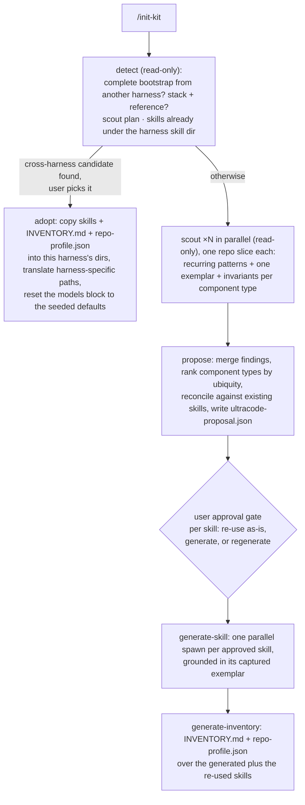

# Agents

Every agent is registered under the plugin's `ultracode:` namespace, so its `subagent_type` is the prefixed
name: `ultracode:explore`, not `explore`. The prefix keeps `explore` and `plan` from colliding with Claude
Code's built-in `Explore` and `Plan` agents, which are not ultracode agents and do not follow this pipeline.
Spawn the names below exactly as written.

The files under `dist/<harness>/ultracode/agents/` are generated. Edit `agents/<name>/definition.json` and
`agents/<name>/prompt.md`, then regenerate all distributions as described in
[Definition authoring](definitions.md).

| Agent (`subagent_type`) | Role |
| --- | --- |
| `ultracode:initializer` | Detect the stack, scout patterns (in parallel), propose skills, then generate skills (in parallel) and the inventory. |
| `ultracode:explore` | Research a topic. Writes a grounded research document plus a criteria document that breaks the request into atomic testable criteria. Anything the repo does not already use (a service, SDK, library, protocol, or third-party API) is looked up on the web and cited, never recalled from memory. |
| `ultracode:generate-spec` | Merge the criteria and research into one spec file (EARS requirements plus Given/When/Then acceptance criteria), with deliverables in build order and the contracts each provides and consumes. |
| `ultracode:fact-check` | Verify every concrete claim a spec or plan makes against the repo or fetched docs. Returns a `{verdict, target, findings}` object. Runs after `generate-spec` and after `plan`, before either reaches its approval gate. `ultracode_gate` requires a `PASS` before it records approval. |
| `ultracode:plan` | Design a phased, verifiable implementation plan from the spec file alone. One agent per request. |
| `ultracode:implement` | Write code for a plan phase, report the changes, and escalate with `HANDOFF:` or `STUCK:` when needed. |
| `ultracode:code-reviewer` | Review changes against the repo's Review Rule Set and return JSON findings. |
| `ultracode:execution-path-analyzer` | Enumerate execution paths per function to drive test writing. Optional stage, runs after every phase, on request. |
| `ultracode:write-test` | Write one test per new execution path, using the repo's test framework. Optional stage, runs after every phase, on request. |
| `ultracode:module-documentation` | Update area references under `skills/module-hub/references/`. Optional stage, runs after every phase, on request. |
| `ultracode:prompt-generation` | Write or edit prompts, skills, and agent files following the meta-author standard. |
| `ultracode:hub-wait` | Wait on the cross-harness hub for the session that spawned it: loop `ultracode_msg_wait` with finite timeouts under the harness's tool-call cap and return the first non-empty result verbatim. Runs on the `fast` tier, pinned by the model router. The only agent whose tool list is an MCP tool. |

The prefix comes from the plugin loader, which registers each agent as `{plugin}:{frontmatter name}`. Agent
files therefore keep a bare `name:` in their front matter. Writing `name: ultracode:explore` would register it
as `ultracode:ultracode:explore`. The `models` keys in `repo-profile.json` stay bare for the same reason.

## How `/init-kit` drives the initializer

`/init-kit` (the main loop) spawns `ultracode:initializer` in six modes. Every stage writes a session-dir file
and returns its path. The user approval gate sits between scouting and generation:

## Re-using existing skills

Re-running `/init-kit`, or running it the first time in a repo that already has hand-authored skills, does not
overwrite what is there. Skills that **detect** finds under the active harness's project skill directory
(`.claude/skills/` for Claude Code, `.grok/skills/` for Grok Build, `.agents/skills/` for Codex) are marked
`status: existing` in **propose** and, by default, re-used as-is: kept on disk and registered in
`INVENTORY.md`, never regenerated.

At the approval gate you can override per skill and force a **regenerate** to rebuild a stale skill from the
current code. Bespoke skills the team wrote, ones that match no scouted component type (say a `deploy` or
`db-migration` skill), are added to the routing inventory too, so the pipeline can load them.

Re-scans are therefore idempotent. Your manual edits to a skill survive, and only the skills you explicitly
ask to generate or regenerate are rewritten.
