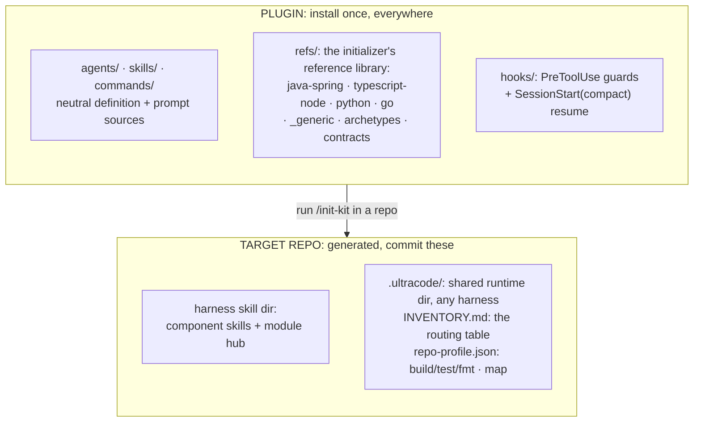
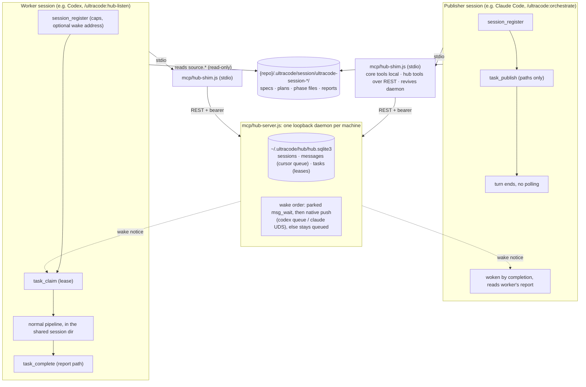
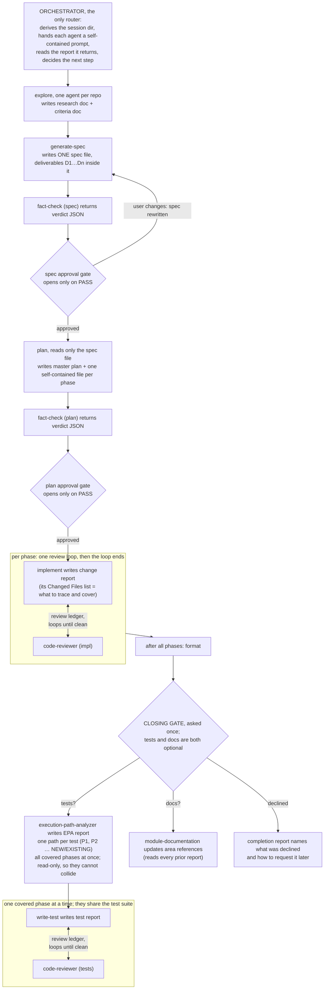

# Architecture

## Two layers: the plugin, and what it generates per repo

The harness-ready plugins (`dist/claude/ultracode/`, `dist/grok/ultracode/`, `dist/codex/ultracode/`,
`dist/antigravity/ultracode/`) are build output and are not committed. `install.sh` regenerates them from the
checkout on every install. Everything else (hook configs, shared hook scripts, refs, assets, neutral command
definitions) lives at the repo root and is translated per target.

Pipeline agents never hardcode a build tool, skill name, or review rule. At run time they read the repo's
inventory and profile from its runtime dir.

The runtime dir is `.ultracode/` at the project root, outside every harness's state dir. One `/init-kit` run
bootstraps the repo for Claude Code, Grok Build, Codex, and Antigravity at once. Only skill and agent
discovery stays harness-specific, because each harness scans its own directory:

| Harness | Inventory/profile dir | Generated project skills |
|---|---|---|
| Claude Code | `.ultracode/` | `.claude/skills/` |
| Grok Build | `.ultracode/` | `.grok/skills/` |
| Codex | `.ultracode/` | `.agents/skills/` |
| Antigravity | `.ultracode/` | `.agents/skills/` |

A repo bootstrapped by an older version still has its runtime dir inside a harness state dir (for example the
`ultracode` subdirectory of the claude state dir). The `detect` mode of `/init-kit` finds those, offers them
as cross-harness candidates, and `adopt` migrates one into `.ultracode/` instead of re-scouting the repo.

Agent, skill, and command authoring is harness-neutral. Each definition directory has `definition.json` and
`prompt.md`, and all four distributions are generated from those sources. See
[Definition authoring](definitions.md).

## Route by inventory, not by description

Harnesses do not reliably route off a skill's `description` front matter. The source of truth is
`INVENTORY.md`, a plain markdown file every agent reads first. It maps component types to skills, path globs
to areas, and lists the build, test, and format commands. Skill auto-discovery is a convenience on top.

## Repo memory

Alongside `INVENTORY.md` and `repo-profile.json`, the runtime dir holds `memory/knowledge.sqlite3`. It stores
durable, repo-scoped lessons: a non-obvious constraint, a subtle invariant, a workaround for a specific bug.
They survive across sessions.

Three MCP tools handle it. They are registered by the shared factory `mcp/create-server.js` (storage logic in
`mcp/lib/memory.js`) alongside the `ultracode_gate` approval tool. Every transport entry point
(`mcp/gate-server.js` over stdio, `mcp/hub-shim.js`, and the hub's `/mcp` endpoint) serves the same tools from
that one factory.

- **`ultracode_memory_recall`**: any agent passes its own `repo_root`, an optional `area` scope (which matches
  nested sub-scopes like `billing-service::InvoiceCalculator`), and a free-text `query` describing its task or
  its failure. It gets back only the relevant lessons, ranked by bm25 within the scope, then repo-wide as fill.
  Agents call it before starting work in an area, and again after a failure with the error as the query.
- **`ultracode_memory`**: records a lesson. Entries dedupe on `(area, lesson)`. A repeat updates the existing
  row's source and timestamp instead of adding a row.
- **`ultracode_memory_forget`**: the only way an entry leaves. An agent removes a single lesson it has confirmed
  is wrong or stale, by exact `(area, lesson)` match. There is no bulk sweep and no automatic trim.

The store has no size cap and never expires entries on a timer. A large multi-module repo accumulates more
lessons than any one session could gather, so it must keep growing. That size is also why it is a real SQLite
database (`node:sqlite` with an FTS5 table for ranked full-text search) rather than a flat file agents read in
full. File-backed SQLite also means two phases running in parallel wait on SQLite's own file lock when they
record a lesson at the same time. An in-memory engine like `sql.js` would have needed a hand-rolled lock file.

Commit it alongside `INVENTORY.md` and `repo-profile.json`. It is binary, so it diffs opaquely. `node:sqlite`
requires Node 22.5 or newer and is still an experimental API (the `engines` field in `package.json` reflects
this). That is the price of FTS5 ranking and OS-level file locking with no added dependency.

## How the agents communicate

Every subagent runs in a forked context. It cannot see the main conversation or another agent's context, and it
cannot spawn agents of its own. Agents are leaves: one job each, returning a file path. The orchestrator is the
single hub, and the session directory is the single shared medium. Every handoff is a file you can open.

**Session dir.** The path is derived, never generated, so a forked agent can compute it without knowing how
the orchestrator chose it:

| Harness | Path |
|---|---|
| Claude Code | `.ultracode/session/ultracode-session-${CLAUDE_CODE_SESSION_ID:-${GROK_SESSION_ID:-no-session-id}}` |
| Grok Build | `.ultracode/session/ultracode-session-${GROK_SESSION_ID:-${CLAUDE_CODE_SESSION_ID:-no-session-id}}` |
| Codex | `.ultracode/session/ultracode-session-${CODEX_THREAD_ID:-no-session-id}` |
| Antigravity | `.ultracode/session/ultracode-session-${ANTIGRAVITY_CONVERSATION_ID:-${AGY_CONVERSATION_ID:-no-session-id}}` |

The harness identifier passes unchanged to spawned agents. Grok also injects `GROK_SESSION_ID` into plugin
hooks, so a hook process that never saw the spawn prompt can still derive the path.

This derivation is idempotent (any agent, anywhere, computes the same path) and collision-free per session (two
sessions against one repo never share a dir). Prompts still carry an explicit `Session dir:` line. The
derivation is a fallback, not a reason to drop the line. It replaced two fragile schemes: a random suffix that
had to be threaded through every prompt, and a "newest dir" lookup that could pick up another session's
artifacts. Do not bring either back.

Each repo in scope gets its own subdirectory of the session dir, named by its **repo key**. Every spawn prompt
carries the key on a `Repo key:` line beside `Session dir:`. Pipeline state splits along that line:

| State | Lives at | Written by | Read by |
|---|---|---|---|
| `factcheck.json` | `{session dir}/{repo key}/` | `hooks/factcheck-record.js` (`hooks/agy-message-record.js` on Antigravity) | the `ultracode_gate` MCP tool, before it records an approval |
| `gates.json` | `{session dir}/` | the `ultracode_gate` MCP tool | `hooks/pipeline-gate.js`, before it lets the next stage spawn |

The split is intentional. A fact-check verdict is about one repo's spec or plan claims. An approval is one
session-level decision over one spec and one plan. What matters is that both sides of each pair resolve the
same path from the same inputs. Every reader and writer first normalizes a declared session dir to the
`ultracode-session-*` directory (`hooks/lib/session.js`), then re-appends the repo key if that state is per
repo. Joining a filename onto whatever form a prompt happened to pass is what once wrote a real `PASS` into
`{session dir}/{repo key}/` and looked for it in `{session dir}/`, so the gate refused an approval for a verdict
that existed. A spawn or gate call with no repo key is refused rather than defaulted, for the same reason:
there is no key both sides would guess the same way.

## How the harnesses communicate

Everything above is one session on one harness. The **cross-harness hub** (docs/hub.md) extends the same
file-passing model across harnesses. Control messages travel through one loopback daemon. The content stays
where it already is, on disk in the shared session dir:

Task payloads carry paths into that session dir, never content. A payload over 32 KiB is refused. The worker
reads artifacts from disk exactly as a forked subagent would. It works inside the session by **adoption**:
`ultracode_session_adopt` records a hub link that authorizes the worker's native session to use a shared
`ultracode-session-<id>` dir it did not create. So a harness can join, or resume, a session it could never
inherit by native id. (The old cross-harness path required both harnesses to launch with the same native id.)
On Claude and Antigravity, `hooks/session-guard.js` reads that link from machine state to allow the shared dir.
Because the dir holds the recorded spec/plan approval, a delegated plan-gated stage spawns without re-approval.
`~/.ultracode` itself (hub queues and adoption links) is tool-owned state protected by location
(`isMachineStatePath` in `hooks/lib/common.js`, enforced by `artifact-guard.js` and `bash-scope-guard.js`),
under the same ownership rule `hooks/lib/ledger-policy.js` applies to the per-repo ledgers.

## The pipeline

No agent calls another. Every hop is a report file in the session dir
(`.ultracode/session/ultracode-session-<session-id>`), written by one agent and read by the next.

**Test coverage is scoped per phase.** `plan` tags each phase `Required` or `Skip`. `Skip` means every step
produces a file with no execution path of its own: a DTO, an interface or enum, a config, DI, or registration
file, a re-export index. There is nothing to trace and nothing to assert. Any logic step, or anything the plan
agent cannot confidently classify, makes the phase `Required`. Ties break toward testing, because a wasted
test pass costs tokens while a wrongly skipped one ships untested behavior. The tag is visible in the Phase
Index at the plan-approval gate, so you can overrule it before any code is written.

**Every planned request goes through one spec file.** `generate-spec` merges research and criteria into a
single `ultracode-spec-*.md`. Requirements are in EARS notation (`WHEN <trigger> THE SYSTEM SHALL <response>`)
with Given/When/Then acceptance criteria, plus the contracts the work provides and consumes. Independently
shippable units are deliverables `D1`, `D2`, ... inside that one file, in a Delivery Order table.

**`plan` reads only that spec file.** No research doc, no criteria doc, no loose answer text. So it cannot be
built against two documents that disagree. It turns deliverables into a master plan whose phases carry a
deliverable ID, a repo, and a dependency set, fanning out wherever phases do not block each other.

Two approval gates sit on this path: the spec (before planning) and the plan (before coding). Each is preceded
by a mandatory `fact-check` pass. `ultracode_gate` will not record approval without a `PASS`, whatever the
orchestrator or the user decides. So no artifact reaches you with a claim that is untrue of the repo. Anything
the user changes at either gate is written back into the spec via `generate-spec`, so the spec stays the one
source everything else traces to.

**The orchestrator is the only router.** Every spawn prompt is self-contained: session dir, exact prior-report
paths, resolved build/test commands, and a `Required skills:` line from the inventory. An agent works, writes
its report, and returns the path. The orchestrator reads it and decides what runs next.

Reports are written for the next agent to consume: exact paths, full signatures, patterns shown in full. Some
channels are structured rather than prose:

- **Review ledger.** One review loop per phase's implementation and per requested phase's tests, each in its
  own file (`ultracode-review-ledger-phase-{N}.md`, `…-phase-{N}-tests.md`) named by the `Phase:` the spawn
  carries. `code-reviewer` logs findings (`F1`, `F2`, ...). `implement` or `write-test` responds `FIXED` or
  `WONTFIX` with a rationale. The reviewer re-raises or closes on the next pass. The loop is capped per loop,
  so an exhausted loop never caps the next one. At the cap the next spawn is offered to the user
  (`review-cap.js` asks rather than denies), so a 4th pass runs only on request. Under **YOLO mode**
  (docs/hub.md, "YOLO mode") the ask becomes a larger automatic budget plus an orchestrator-resolution step
  at exhaustion. An unattended run never parks on the question, and open findings are never carried into
  dependent phases.
- **JSON findings.** `code-reviewer` returns one machine-parseable object so the orchestrator can split
  findings by severity and rule ID. **Auto-fixable** findings carry an exact replacement the orchestrator
  applies directly, skipping a fix-agent round trip.
- **Progress log.** `implement` checkpoints after every step, so a re-spawn resumes instead of redoing work.
- **`HANDOFF:` and `STUCK:` escalation.** A leaf agent cannot spawn help, so it escalates upward with a text
  prefix. `HANDOFF:` asks the orchestrator to spawn a specialist (for example `prompt-generation` for a
  `SKILL.md` or prompt file) and then resume the original agent. `STUCK:` asks for rescue context or a user
  decision after repeated failures.

**Initialization uses the same channel, spawned directly.** `/init-kit` fans the `initializer` agent out via
the Agent tool, with parallel calls where stages are independent. Each stage writes a session-dir file and
returns the path. The `propose` stage's `ultracode-proposal.json` is what the main loop reads to build the
approved skill set. A user-approval gate sits between scouting and generation.

## Design notes

- **Portable tools only.** Every agent uses `Read/Edit/Write/Bash/Grep/Glob`. No MCP or language server is
  assumed. Skill loading is harness-specific: Claude Code has a `Skill` tool. Codex and Grok Build have none,
  so agents read the skill's `SKILL.md` instead. Agents prefer a code-graph MCP if one exists, else fall back
  to Grep and Glob.
- **Seeded from real setups.** The pipeline agents, `orchestrate`, `meta-author`, and the stack references
  were generalized from production agent kits and grounded against real Java/Spring, TypeScript, and Go
  codebases.
- **Model tiers, per repo and per phase.** The `models` block of `repo-profile.json` decides which model each
  subagent spawn runs on: a static tier per agent, and a per-phase-complexity tier for `implement` and
  `write-test`. `hooks/model-router.js` applies it as a `PreToolUse` hook on every spawn, translates it for the
  active harness, and denies any spawn it cannot resolve. `/init-kit` seeds defaults. Edit the block to
  override. See [Model routing](model-routing.md) for the value forms, the denial cases, and the two exempt
  agents.
  - Init-kit's own skill generation always runs on the active harness's advanced model, set by the init-kit
    entry point rather than the profile.
  - `PreToolUse` hooks do not compose. Both hooks on a matcher see the original tool input, and only one
    `updatedInput` survives. So `model-router.js` is the only place an agent spawn may be rewritten.
    Spawn-time prompt injection lives there for that reason.
  - Hook policy reads `hooks/lib/hook-context.js`, not raw payload fields. `hooks/lib/harness.js` declares
    each harness's tool-input, result, session, actor, transcript, prompt, model, command, and path fields.
    It normalizes Claude/Codex snake_case, Grok camelCase, and Antigravity's `toolCall.args.Subagents[]`
    envelope.
  - A spawn call is a list, even on harnesses whose normal form is one flat object. Routing and every spawn
    guard iterate the complete list. A malformed later `Subagents[]` entry denies the whole call instead of
    slipping past policy behind entry zero.
  - `hooks/subagent-parameters.json` is the runtime contract: one parameter catalog plus the required set for
    every agent, including the initializer's mode-specific requirements.
    `definitions/subagent-parameters.schema.json` defines that manifest's shape. `session-guard.js` validates
    the literal `Label: value` lines before a spawn.
  - `Repo root:` and session ownership are separate on purpose. `Repo root:` is the checkout the leaf agent
    works in. The required `Primary repo root:` names the repository that owns the
    `.ultracode/session/ultracode-session-*` root. Reports, gates, fact-checks, progress, scope, and
    build-streak state stay in that primary root even when the work repo is another checkout. This keeps
    pipeline state in one place.
  - The Write, Edit, and Bash scope guards therefore protect two roots for a leaf spawn: the primary session
    dir (reports and state only) and the work `Repo root:` (source). A phase file's path list is recorded in
    `spawn-scope.json` as a hint for implementers, since skills may require companion files the plan omitted.
    It is not a write allowlist. `currentActor()` prefers the transcript's `Repo root:`, `Repo key:`, and
    `Session dir:` over the harness cwd, so a Claude secondary-repo implement is not confined to the primary
    checkout.
  - What each harness does not dispatch or honor (which spawn hooks reach it, which output shapes it discards,
    and whether a hook can hand a decision to the user at all) is measured per CLI in
    [Harness limitations](harness-limitations.md). Read it before assuming a guard described here is enforced
    everywhere.
