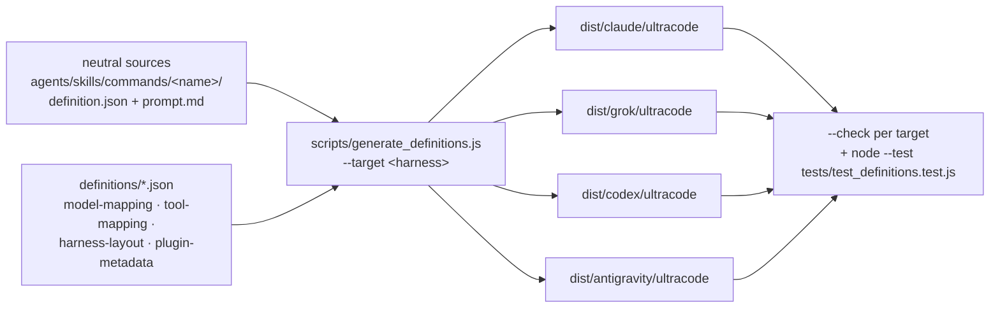

# Definition authoring

Agent, plugin-skill, and command prompts have one harness-neutral source. Each definition owns a directory:

```text
agents/<name>/
├── definition.json
└── prompt.md

skills/<name>/
├── definition.json
└── prompt.md

commands/<name>/
├── definition.json
└── prompt.md
```

`definition.json` contains the name, description, prompt path, and portable configuration. Agent configuration
also records a neutral model tier, reasoning effort, canonical capabilities, timeout, and context mode. Command
configuration records its argument hint. `prompt.md` contains only the prompt body. Generation preserves its
formatting.

The schema is `definitions/definition.schema.json`. Neutral model tiers resolve through
`definitions/model-mapping.json`:

| Tier | Claude Code | Codex | Grok Build | Antigravity |
|---|---|---|---|---|
| `fast` | `haiku` | `gpt-5.6-luna` | `grok-4.5` | `flash` |
| `balanced` | `sonnet` | `gpt-5.6-terra` | `grok-4.5` | `flash` |
| `advanced` | `opus` | `gpt-5.6-sol` | `grok-4.5` | `flash` |
| `frontier` | `fable` | `gpt-5.6-sol` | `grok-4.5` | `flash` |

Every Grok and Antigravity tier currently resolves to the same model. `frontier` differs from `advanced` only
on Claude Code, where it selects Claude Fable 5.

Canonical capabilities and their per-harness translations are listed in `definitions/tool-mapping.json`. Add a
mapping before using a new capability in a definition. Where a harness has no equivalent, the mapping emits an
instruction instead of a tool:

- No `Skill` tool on Codex, Grok Build, or Antigravity: the agent reads the skill's `SKILL.md` with the
  harness read capability (`view_file` on Antigravity).
- No dedicated plan-mode tool on Grok or Antigravity: a conversation instruction.
- Claude's several file and search tools map to Codex's `exec_command` and `apply_patch`, to Grok's
  `read_file`, `search_replace`, `grep`, `list_dir`, and `run_terminal_command`, and to Antigravity's
  `view_file`, `replace_file_content`, `write_to_file`, `run_command`, `grep_search`, and `find_by_name`.
- The plugin's own MCP tools are capabilities too: `hub_wait`, `report`, `memory`, `memory_recall`, and
  `factcheck`. An agent declares one only when its prompt calls that tool, and a test holds the two in step,
  so no agent is handed an MCP tool it never uses. Each harness needs a different shape. Claude Code treats
  an explicit `tools:` list as an allowlist that drops every MCP tool not named, so the Claude value is the
  full `mcp__plugin_ultracode_ultracode-gate__<tool>` name. Codex role files have no tool list, so the
  generator writes the bare tool name into the tool-vocabulary policy. Without it the role reports the tool
  as unavailable even though its thread has it. Grok Build and Antigravity subagents inherit the session's MCP
  registry, so their values are prose that stays out of the native tools list (Antigravity agents also carry
  `inheritMcp: true`). A prose value on any harness means "no tool needed here": `factcheck` is prose on Claude
  and Antigravity because a hook records the fact-check verdict there.

Harness-owned repo paths and session identifiers are defined in `definitions/harness-layout.json`. Every
harness shares one runtime dir for inventory, profile, and session scratch: `.ultracode` at the project root,
outside any harness state dir. The generator enforces this: `runtime_dir` must be identical across all four
layouts and must not be nested. Only skill discovery stays harness-specific (`.claude/skills`, `.grok/skills`,
and `.agents/skills` for both Codex and Antigravity). The generator translates these paths in prompts,
descriptions, references, session hooks, and the model router. Do not hardcode a harness path inside a
definition.

Use these tokens in neutral `prompt.md` files, definition descriptions, and shared Markdown references:

| Token | Meaning |
|---|---|
| `{{state_dir}}` | Harness project-state parent (`.claude`, `.grok`, `.codex`, or `.agents`) |
| `{{runtime_dir}}` | Ultracode inventory, profile, memory, and session directory. `.ultracode` for every harness |
| `{{skills_dir}}` | Harness-specific project skill discovery directory |
| `{{agents_dir}}` | Harness-specific project agent-definition directory |
| `{{plugin_root}}` | Harness-provided environment expression for the installed plugin root |
| `{{arguments}}` | Claude/Grok/Antigravity command arguments (`$ARGUMENTS`) or the request text following a Codex skill invocation |
| `{{command_prefix}}` | Invocation prefix (`/` for Claude, Grok, and Antigravity, `$` for Codex) |
| `{{agent_selector}}` | Agent-spawn selector field (`subagent_type` or `agent_type`) |
| `{{tool_delegate}}` | Agent-spawn tool name (`Agent`, `spawn_subagent`, `spawn_agent`, or `invoke_subagent`) |
| `{{session_id_expr}}` | Harness session expression configured by the selected layout |
| `{{session_id_source}}` | Prose description of the harness session identifier |
| `{{session_id_names}}` | Harness session identifier names and fallback behavior |
| `{{session_id_agent_names}}` | Harness session identifier wording used by subagents |
| `{{session_id_inheritance}}` | Harness session inheritance statement used by the orchestrator |
| `{{session_id_unavailable}}` | Harness session-unavailable condition and fallback branch |
| `{{balanced_model}}` / `{{advanced_model}}` | Concrete target models for spawns that run before a profile exists |
| `{{reload_action}}` | Harness-specific instruction for discovering newly generated skills |

For example, write the profile path as `{repo-root}/{{runtime_dir}}/repo-profile.json` and a generated skill
as `{repo-root}/{{skills_dir}}/{name}/SKILL.md`. Generation resolves the tokens for the selected harness.
Validation rejects concrete `.claude/`, `.grok/`, `.codex/`, or `.agents/` paths, harness-specific plugin-root
variables, and concrete harness session identifier names in neutral sources. It also rejects unknown template
tokens and unresolved template tokens in output.

## Subagent parameter contracts

`hooks/subagent-parameters.json` defines the prompt parameters that are required before each Ultracode agent
may spawn. Parameters are canonical IDs with one or more literal prompt labels, a type, and optional enum
values. Each agent lists its required IDs, alternatives, and initializer mode-specific additions.
`definitions/subagent-parameters.schema.json` defines the manifest shape. The generator bundles the manifest
and `hooks/lib/subagent-params.js` into every target. `session-guard.js` validates every decoded spawn entry.

The four common parameters have separate jobs:

- `Primary repo root:` names the repository that owns the session root. It is required because some harnesses
  do not preserve workspace ordering when extra repositories are attached.
- `Repo root:` is the working repository for source, profile, and skills. It may differ per subagent.
- `Session dir:` is the report and state path under the **primary** repo's session root.
- `Repo key:` is the stable state-address key and repo subdirectory name.

Do not derive `Session dir:` from `Repo root:` in a cross-repo spawn. The primary repo owns shared pipeline
state. The work repo owns only the source files the agent reads or changes.

## Generate

One neutral source tree feeds all four distributions. Validate what you generated before publishing:



Generate the Claude Code plugin distribution with:

```bash
node scripts/generate_definitions.js --target claude
```

This writes `agents/<name>.md`, `skills/<name>/SKILL.md`, `commands/<name>.md`, both Claude manifests, hooks,
references, assets, and the license beneath the plugin root. They are generated files. Make changes in the
root authoring sources and regenerate.

Generate the Grok Build plugin distribution with:

```bash
node scripts/generate_definitions.js --target grok
```

This writes Claude-shaped `agents/<name>.md`, `skills/<name>/SKILL.md`, and `commands/<name>.md`, plus
`.grok-plugin/plugin.json`, `.grok-plugin/marketplace.json`, `.mcp.json` for the bundled gate server, and
Grok-adapted hooks under `hooks/`. Agent front matter uses Grok's `prompt_mode`, `permission_mode`, `effort`,
and `tools` fields and omits `model`, so the model-router hook (or inherit-parent) stays authoritative.
`effort` is taken from `reasoning_effort.grok`, falling back to `reasoning_effort.claude`. Grok has no
`Skill`, structured-question, or plan-mode tools, so those capabilities emit a read-the-`SKILL.md` instruction
or a conversation note, the same way Codex does.

Generate the Antigravity plugin distribution with:

```bash
node scripts/generate_definitions.js --target antigravity
```

This writes `plugin.json`, `mcp_config.json`, `hooks.json`, `rules/AGENTS.md`, `agents/<name>.md`, and
`skills/<name>/SKILL.md` beneath `dist/antigravity/ultracode`. Agent front matter includes `name`, `model`,
`effort`, and mapped Antigravity `tools`.

Generate the Codex plugin distribution with:

```bash
node scripts/generate_definitions.js --target codex
```

This writes Codex agent role files to `agents/<name>.toml` and Codex skills to `skills/<name>/SKILL.md` beneath
the Codex plugin root, with plugin metadata at `.codex-plugin/plugin.json` and target-adapted lifecycle hooks
under `hooks/`. Two Codex-specific adaptations:

- **Commands become skills.** Plugin-bundled custom prompts are unsupported, and standalone Codex custom
  prompts are deprecated and local-only. So each command is emitted as an explicitly invoked skill at
  `skills/<command>/SKILL.md`, with `agents/openai.yaml` setting `policy.allow_implicit_invocation: false`.
  Invoke it as `$<command>`.
- **Role TOML is narrower than Claude front matter.** It supports developer instructions, model and reasoning
  settings, and sandbox mode, but not per-agent timeout, fork-context, or a granular tool allowlist. The
  generator keeps timeout and context in source comments, derives `sandbox_mode` from write capabilities, and
  prepends an explicit tool-vocabulary policy to the preserved prompt. `model` is omitted on purpose:
  role-level model settings outrank spawn arguments, so `hooks/model-router.js` supplies the profile-selected
  model instead.

Output goes to `dist/<target>/ultracode` beneath `--source-root` unless `--output-dir <path>` says otherwise.
`dist/` is build output: gitignored, never committed, and regenerated by `install.sh` from the checkout on
every install, so no distribution can ship stale. Generate it yourself before a manual install or a validation
run.

The generator writes `hooks/model-routing.json` per target from the neutral model mapping and agent defaults.
Runtime repo profiles normally select `fast`, `balanced`, or `advanced`. Use `"default"` to select the agent's
generated default explicitly, or `"inherit"` to leave the spawn model unchanged. These two values distinguish
an intentional fallback from a missing route, which the hook denies once a profile exists.

## Validate

Check a previously generated Claude output without modifying it:

```bash
node scripts/generate_definitions.js --target claude --check
```

Check a previously generated Grok output and validate its manifest:

```bash
node scripts/generate_definitions.js --target grok --check
grok plugin validate dist/grok/ultracode
```

Check a previously generated Antigravity output and validate its manifest:

```bash
node scripts/generate_definitions.js --target antigravity --check
agy plugin validate dist/antigravity/ultracode
```

Check a previously generated Codex plugin output and validate its manifest:

```bash
node scripts/generate_definitions.js --target codex --check
node /path/to/plugin-creator/scripts/validate_plugin.js dist/codex/ultracode
```

Run all structural, equivalence, deterministic-generation, tool-mapping, and TOML checks with:

```bash
node --test tests/test_definitions.test.js
```

The Claude equivalence baseline stores frontmatter values and prompt hashes rather than duplicate prompt
copies. The tests generate every target twice, compare the trees byte for byte, parse every Codex agent TOML
file, validate each source against JSON Schema when `jsonschema` is installed, and check that all declared and
orchestration capabilities appear in the mapping.
