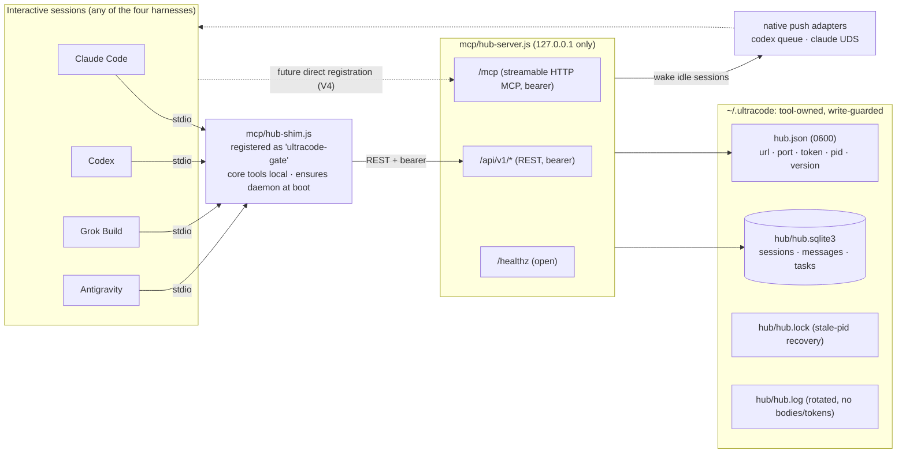
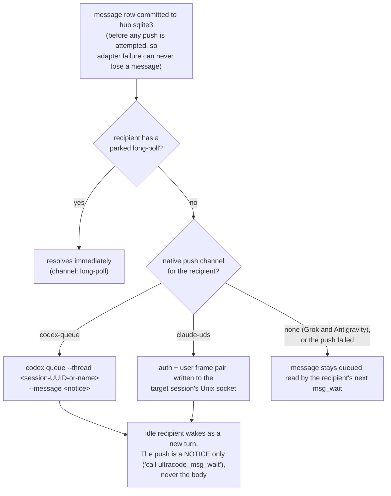
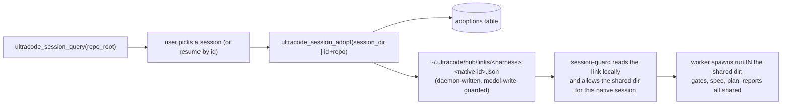
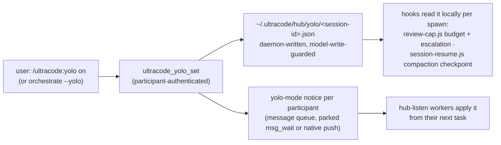

# The cross-harness hub

One HTTP MCP daemon per machine that lets interactive sessions on different harnesses (Claude Code, Codex,
Grok Build, Antigravity) message each other and hand each other tasks. There is no third-party model proxy,
and no context is shipped that already sits on disk. A task is a set of paths into the shared
`.ultracode/session/...` directory. The worker harness reads the artifacts itself. This keeps each harness
talking only to its own vendor, and it means orchestration context is never re-serialized into a prompt.

## Topology



- **`mcp/hub-server.js`** is the daemon. It binds to loopback only (`127.0.0.1`) and uses bearer-token auth
  compared with `timingSafeEqual`. The default port is `45777`. `ULTRACODE_HUB_PORT` overrides it, and if
  another process holds the port the daemon moves to an ephemeral port recorded in `hub.json`. It serves
  `/healthz` (open), `/api/v1/*` (REST, used by the shim), and `/mcp` (stateless streamable-HTTP MCP exposing
  all 15 tools).
- **`mcp/hub-shim.js`** is the stdio entry point every harness registers (still named `ultracode-gate`). Core
  tools (gate, report, memory) run locally, identical online or offline. Hub tools travel over REST. At boot
  it revives a dead hub (bounded to 5 s) and replaces an older-versioned one. MCP-server startup acts as a
  session start that even hook-less harnesses honor. `ULTRACODE_HUB_DISABLE=1` opts out entirely.
- **`mcp/hub-ctl.js`** offers `ensure | start | stop | status | rotate-token`. The installer runs
  `ensure --restart-if-older`. Humans use the rest. Token rotation needs no restarts: the daemon and every
  client read `hub.json` per call.
- **`mcp/gate-server.js`** is the unchanged offline stdio server (core tools only), kept as an emergency
  registration.

Why a stdio shim instead of registering the HTTP URL directly: the shim is the one registration shape all four
harnesses support today, it keeps the bearer token and port out of generated configs (so rotation never breaks
a registration), and it gives the hub its lazy-start path. Direct `url` registration (Codex
`bearer_token_env_var`, Grok config.toml `url`, Claude `type: "http"`) adds no v1 capability, because wakes
travel over native channels rather than MCP. It is deferred until verified per harness (V4 below).

## The tool surface

Five core tools (`ultracode_gate`, `ultracode_report`, `ultracode_memory`, `ultracode_memory_recall`,
`ultracode_memory_forget`) plus ten hub tools, all registered from one factory (`mcp/create-server.js`) so
stdio and HTTP can never drift:

| Tool | What it does |
|---|---|
| `ultracode_session_register` | Join the registry with harness, explicit session id, repo roots, own session dir, capabilities, and an optional native wake channel. Returns `session_key`, `session_secret`, and a starting `cursor`. Re-registering rotates the secret. Anonymous ids (`no-session-id`) are refused. |
| `ultracode_session_heartbeat` | Reports pending messages and open tasks. Rarely needed for liveness: every authenticated call refreshes the registration, a parked `msg_wait` keeps it alive, and an idle registration survives 7 days. Long tasks never re-register. |
| `ultracode_session_list` | Lists live, reachable sessions, filterable by harness or repo root. Secrets never leave the hub. |
| `ultracode_session_query` | Lists the shared ultracode sessions known for a repo (id, dir, inferred stage, participants, last activity). Used by the hub-listen picker and for resume. |
| `ultracode_session_adopt` | Authorizes this session to work inside a shared ultracode session it did not create (by dir, or by id plus repo for resume). Returns the shared `session_dir` to use as `Session dir:` from then on. |
| `ultracode_msg_send` | Sends a direct message (`to_session_key`) or a harness broadcast (`to_harness`). Returns immediately. The body is capped at 64 KiB and carries paths, not content. `dedupe_key` makes retries idempotent. |
| `ultracode_msg_wait` | One cursor-based long-poll. `timeout_ms: 0` parks indefinitely. That is the listening state for pull-only harnesses, ended only by a message, a hub restart, or the user pressing ESC (the harness's MCP cancellation aborts the request and the hub reaps the waiter; a dropped connection reaps it too). Finite waits default to 25 s and cap at 120 s. Reads destroy nothing. Passing the advanced cursor on the next call is the acknowledgement, so every ending is lossless. |
| `ultracode_task_publish` | Queues a task addressed by `target_harness` or `capability`. The payload is validated against the same required-inputs contract as subagent spawns, capped at 32 KiB, with all paths confined to the publisher's session dir. Candidate workers are woken automatically. |
| `ultracode_task_claim` | Takes an exclusive claim under a lease (default 15 min, cap 60). Expired leases reopen the task with `attempts` incremented. The third expiry fails the task and notifies the publisher. |
| `ultracode_task_complete` | Records `done` or `failed`, a summary, and a `report_file` inside the worker's own session dir. Inserts the completion message and wakes the publisher. |
| `ultracode_yolo_set` | Toggles YOLO mode for one primary ultracode session. User-initiated only (`/ultracode:yolo`, or orchestrate's `--yolo` flag). The caller must be registered with, or have adopted, the target session dir. Persists to `~/.ultracode/hub/yolo/` (where the hooks read it) and notifies every other participant through the message queue, waking parked listeners. |
| `ultracode_yolo_status` | Reads a session's YOLO state (by `session_dir`, or `ultracode_session_id` plus `repo_root`). Returns `enabled: false` when never toggled. Answered from the same machine-state file the hooks read, so tool and hook can never disagree. |

## Delivery: push first, one pull as fallback

The goal is that a sender ends its turn after `msg_send` or `task_publish` instead of burning tool calls
polling. Delivery order for each committed message:



Because the push carries a notice and never the body, a spoofed native channel can at worst trigger an empty
authenticated fetch. Both channels are on by default and need no per-session setup. When a registration
carries no explicit `native_channel`, the channel is inferred from the harness and addressed by the harness
session id every registration already has. An explicit `native_address` (a `/rename`d name) still wins. Opt a
daemon out with `ULTRACODE_HUB_CLAUDE_PUSH=0` or `ULTRACODE_HUB_CODEX_PUSH=0`.

- `codex-queue` (`mcp/lib/push/codex.js`) runs `codex queue --thread <session-UUID-or-name> --message
  <notice>`. The syntax was verified on codex-cli 0.151.0 (V3). It is feature-detected: a CLI without `queue`
  (before 0.149.0) reports unavailable and the harness stays pull-only.
- `claude-uds` (`mcp/lib/push/claude.js`) writes a newline-delimited `{type:"auth"}` plus `{type:"user"}`
  frame pair to the target session's Unix socket (`~/.claude/sessions/<pid>.json`, matched by name or
  `sessionId`; the peer token comes from the sibling `<pid>.<sha256(socketPath)>.key`). This is the same
  mechanism Claude Code uses for its own cross-session messaging. Verified end to end on 2.1.251 (V2),
  including waking a live interactive session. The frame shape is reverse-engineered and tied to the Claude
  version, so a Claude update that changes it degrades delivery to pull rather than erroring. The adapter does
  not defeat Claude's inbound gate: a session in `bypassPermissions` mode holds a peer message for the user's
  approval. Since the payload is only a wake notice, a held or missed push costs nothing. To skip the hold and
  deliver hub notices immediately, set `"crossSessionInbound": "accept"` in `~/.claude/settings.json`. That is
  a per-user trust decision Claude Code owns. ultracode documents it but never sets it for you.

On the receiving side, the user opens a session on the harness they want doing the work and runs
`/ultracode:hub-listen`: register, drain the task queue, one `msg_wait`, end turn. The publisher's flow is the
"Cross-harness delegation" section of `/ultracode:orchestrate`.

## Harness routing (`repo-profile.json`, `harnesses` section)

This is the harness-level sibling of the `models` section: per-agent (and per-phase-complexity) routes naming
which **harness** should execute a stage. The orchestrator reads it to decide between spawning locally and
publishing a hub task.

```json
"harnesses": {
  "byAgent": { "implement": "codex", "write-test": "codex" },
  "byPhaseComplexity": { "implement": { "low": "codex", "medium": "codex", "high": "claude" } }
}
```

Three rules keep it safe (the full contract is in `refs/inventory-and-profile.md`):

- **Values are concrete harness names only** (`claude|codex|grok|antigravity`). Never a relative term like
  `"local"`. A worker harness reading the same profile would resolve `"local"` to itself and keep
  orchestrating instead of reporting back. "Runs with the orchestrator" is expressed by omitting the route.
- **Absence never fails anything.** No section, no map, no key, or an unrecognized value all fall back to the
  current harness, exactly as if the feature were unconfigured. An untargeted publish likewise defaults to
  the publisher's own harness, never "any harness". Unlike model routing, there is no deny-on-missing-route.
- **The hub resolves the route itself, at publish time.** `ultracode_task_publish` re-reads
  `repo-profile.json` on every call (the same freshness rule the model-router hook applies to model routes),
  so a mid-session profile edit affects the very next publish. A caller-passed `target_harness` that
  contradicts the current profile is refused with the routed harness named. The orchestrator reads the
  section only to decide whether to delegate, and a routed harness with no listening session falls back to a
  local spawn rather than failing. The initializer never seeds this section. Users add it when they actually
  run a second harness.

## Session adoption: sharing a session without inheriting a native id

Ultracode's session dir is `{repo}/.ultracode/session/ultracode-session-<id>/`, where `<id>` is the harness's
native session id. Two harnesses could once share a session only by being launched with the same native id
(so their derived dirs matched). On Claude and Antigravity, `hooks/session-guard.js` rejects a spawn whose
declared `Session dir:` id is not the running session's, which shows up as an "invalid session id" error.

Adoption replaces id-inheritance with a hub-authorized link:



- The worker registers its own native session, then adopts the shared one. From then on the shared
  `session_dir` is its `Session dir:` for every spawn and hub call.
- **Registration is a standing orchestrate step, and the query is the only discovery channel.** Every
  `/ultracode:orchestrate` session registers at session start. An unregistered session is invisible to
  `ultracode_session_query`. That once led a worker to hunt for `ultracode-session-*` directories on disk and
  pick a stale one. Workers never do filesystem discovery, and the hub refuses to adopt a target whose session
  dir does not exist, so a guessed id fails visibly instead of creating a link to an empty dir.
- `session-guard` allows that dir because the daemon-written link authorizes this native session for it. The
  link is a file under `~/.ultracode` that models cannot write (`isMachineStatePath`), so it cannot be forged
  to smuggle a spawn into an arbitrary dir. The lookup is a local read: no network on the spawn path, and it
  survives a hub restart mid-session. Codex and Grok run no spawn hooks, so they use the shared dir freely
  with nothing to authorize.
- Because the shared dir holds the recorded plan and spec approval, a delegated plan-gated stage spawns
  without re-approval. `hooks/pipeline-gate.js` reads the gate from that same dir.
- **Resume** uses the same mechanism. A session whose original harness broke is still listed by
  `ultracode_session_query`. Another harness adopts it by id and continues from its recorded stage.

## YOLO mode: one toggle, every participant

YOLO mode is the user's standing permission for fully autonomous resolution during the implementation phases
of one primary ultracode session. It fixes runs that die overnight on a review-cap approval prompt, a
closing-gate question, or a formatting failure after the user already approved the spec and the plan. It
never waives the spec and plan gates, fact-check `PASS`es, or `BLOCKER` security findings. It changes who
answers operational questions mid-run (the orchestrator, with everything deferred into the completion
report), not what must be true.



Design decisions, consistent with the rest of this document:

- **State is machine-level and keyed by the primary session, not per repo.** One file per
  `ultracode-session-<id>` under `~/.ultracode/hub/yolo/`. Every child of the session (subagent hooks,
  adopted workers on other harnesses) resolves the same file from the session dir alone. A hub restart loses
  nothing.
- **The daemon is the only writer**, like the adoption links. `isMachineStatePath` write-guarding means a
  model cannot forge the user's own permission switch, and toggling through the tool requires being a
  registered participant (own dir, or adopted). The user flips it, via the `/ultracode:yolo` command or
  orchestrate's `--yolo` flag. The model never does on its own initiative.
- **Mid-session toggles are pushed, not polled.** `ultracode_yolo_set` inserts one `yolo-mode` notice per
  other participant and delivers it through the normal order (parked `msg_wait` first, then native push). A
  parked listener applies the new mode to its next task. The state file is already updated when the wake
  arrives.
- **The autonomous loop is continuous and survives compaction.** Under YOLO, `hooks/review-cap.js` swaps the
  review-loop ask for a larger budget (10 passes per loop). At exhaustion it denies the spawn with an
  orchestrator-resolution protocol: fix the open findings, then exactly one verification pass per denial,
  tracked in `ultracode-yolo-review-escalations.json`. So open findings are never carried into dependent
  phases. `hooks/session-resume.js` restates the YOLO state in its post-compaction checkpoint, so a compacted
  orchestrator resumes autonomously instead of rediscovering or forgetting the mode.

## Security model

- Loopback bind is hard-coded. The bearer token is 64 hex characters in `hub.json` (mode 0600, dir 0700),
  compared timing-safe.
- Per-session secrets stop one local session impersonating another's heartbeat, claim, or complete.
- Every path in every payload is validated with the same helpers the hooks use (`sessionBaseDir`,
  `normalizeRepoKey`, `isInside` from `hooks/lib/`). Session dirs must sit under a declared repo root's
  `.ultracode/session`, artifact paths inside the publisher's session base, report files inside the worker's.
- Body caps: 2 MiB HTTP, 64 KiB message, 32 KiB task payload. The limits enforce path-passing mechanically and
  stay far from the 10 MiB stdio JSON-RPC failure class.
- `~/.ultracode` is tool-owned by location. `isMachineStatePath()` (hooks/lib/common.js) is enforced by
  `artifact-guard.js` and `bash-scope-guard.js`, so a model-issued write cannot forge messages, tasks, or
  acknowledgements, and cannot modify the token via the write path. Reads are not blocked. The trust boundary
  is the local user account, as with every MCP stdio server.
- Adoption links live in machine state (`~/.ultracode/hub/links`, daemon-written, `isMachineStatePath`
  write-guarded), so a worker cannot authorize itself into a session dir the user did not adopt through the
  tool. `session-guard` still checks the repo-key subdirectory of an adopted dir, exactly as for a native one.
- YOLO state lives under the same ownership rule (`~/.ultracode/hub/yolo`, daemon-written). The write guards
  stop a model from switching its own run to autonomous, and `ultracode_yolo_set` also requires the
  caller to be a participant of the session it toggles. One local session cannot flip another run's autonomy
  on a bearer token alone.
- Log lines carry routes and ids, never bodies or tokens.

## Live-verification ledger

Mirrors docs/harness-limitations.md: a dated, measured entry gates each feature flag.

| # | Claim to verify | Gates | Status |
|---|---|---|---|
| V1 | SDK 1.30.0 or newer ships server and client streamable HTTP | `/mcp` endpoint | **Verified 2026-08-30** (both import paths resolve; exercised by tests) |
| V2 | Claude Code UDS frame shape (auth + user frames) | `claude-uds` default-on | **Verified end to end 2026-08-30 on 2.1.251** (live interactive session woken; sender pid verified by recipient). Default-on, `ULTRACODE_HUB_CLAUDE_PUSH=0` to opt out. Degrades to pull if a Claude update changes the frames |
| V3 | `codex queue` flags and behavior (0.149.0 or newer) | pinning `push/codex.js` argv | **Verified 2026-08-30 on 0.151.0**: `codex queue --thread <UUID\|name> --message <text>`. Pinned, default-on, `ULTRACODE_HUB_CODEX_PUSH=0` to opt out. Feature detection keeps pre-0.149 CLIs pull-only |
| V4 | Direct HTTP MCP registration per harness (Codex `url` plus `bearer_token_env_var`, Grok config.toml `url`, Claude plugin `type:"http"`, AGY `agy mcp add --url`) | a `--mcp-transport http` generator mode | Open. Shim registration is v1 for all four |
| V5 | Per-harness tool-call duration caps that cut a `msg_wait` park | documented behavior per harness | **Measured 2026-08-30**. See "Tool-call duration caps" in docs/harness-limitations.md (codex backgrounds then caps, but push wakes it anyway; claude honors `MCP_TOOL_TIMEOUT`; agy and grok cut, and you re-run). Always harmless: registration and cursor survive |

## Operations

```bash
node <plugin>/mcp/hub-ctl.js status          # is it up, which version, which port
node <plugin>/mcp/hub-ctl.js ensure          # start if dead (idempotent)
node <plugin>/mcp/hub-ctl.js rotate-token    # new bearer token, zero restarts
node <plugin>/mcp/hub-ctl.js stop            # SIGTERM (drains long-polls with shutdown:true)
tail ~/.ultracode/hub/hub.log                # delivery/debug log
ULTRACODE_HUB_DISABLE=1                      # per-process opt-out (shim serves core tools only)
```

Uninstalling stops the daemon but leaves `~/.ultracode` (token and queues) so a reinstall keeps working.
Delete the directory to purge it. Grok double-loads Claude-installed plugins. A second shim process is
harmless: registration is idempotent, and the lock keeps the daemon single.

## Live-testing recipe (isolated, all harnesses in parallel)

`ULTRACODE_HUB_HOME` relocates all machine state, so a live cross-harness test never touches the real
`~/.ultracode`. Export it (plus `ULTRACODE_HUB_PORT=0`) in the shell that launches each harness. MCP server
children inherit it. Register the shim under a throwaway server name so an installed ultracode plugin's own
registration cannot collide:

```bash
export ULTRACODE_HUB_HOME=/tmp/uc-live/hub-home ULTRACODE_HUB_PORT=0
node mcp/hub-ctl.js ensure

# Claude Code: config file + tool allow, headless
claude -p "<register/publish/wait prompt>" --mcp-config mcp.json --strict-mcp-config --allowedTools "mcp__uchub"
# Codex: -c overrides; the bypass flag is REQUIRED for MCP calls on 0.147.0 (see harness-limitations)
codex exec --skip-git-repo-check --dangerously-bypass-approvals-and-sandbox \
  -c 'mcp_servers.uchub.command="node"' -c 'mcp_servers.uchub.args=["<abs>/mcp/hub-shim.js"]' "<prompt>"
# Grok: register user-level and run from a TRUSTED directory (see harness-limitations)
grok mcp add uchub node -- <abs>/mcp/hub-shim.js && grok -p "<prompt>" --permission-mode bypassPermissions
# Antigravity: global registration, headless print
agy mcp add uchub node <abs>/mcp/hub-shim.js && agy -p "<prompt>" --dangerously-skip-permissions --print-timeout 5m
```

Blocking `ultracode_msg_wait` calls in a headless run need the harness's MCP tool timeout raised
(`MCP_TOOL_TIMEOUT=180000` for Claude) and the prompt told that the block is expected. Clean up with
`grok mcp remove uchub`, `agy mcp remove uchub`, and `node mcp/hub-ctl.js stop` under the same env.
