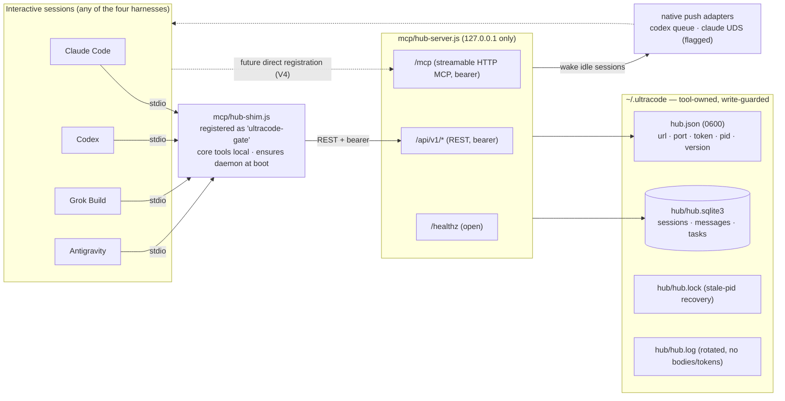

# The cross-harness hub

One HTTP MCP daemon per machine that lets interactive sessions on different harnesses (Claude Code, Codex,
Grok Build, Antigravity) message each other and hand each other tasks — without a third-party model proxy,
and without shipping context that already sits on disk. A task is a set of **addresses** into the shared
`.ultracode/session/...` directory; the worker harness reads the artifacts itself. That is both the policy
story (each harness talks only to its own vendor) and the token story (orchestration context is never
re-serialized into a prompt).

## Topology



- **`mcp/hub-server.js`** — the daemon. Loopback-only (`127.0.0.1`), bearer-token auth
  (`timingSafeEqual`), fixed default port `45777` (`ULTRACODE_HUB_PORT` overrides; a foreign occupant
  pushes it to an ephemeral port recorded in `hub.json`). Serves `/healthz` (open), `/api/v1/*` (REST used
  by the shim), and `/mcp` (stateless streamable-HTTP MCP exposing all 13 tools).
- **`mcp/hub-shim.js`** — the stdio entry point every harness actually registers (still named
  `ultracode-gate`). Core tools (gate/report/memory) run locally, identical online or offline; hub tools
  travel over REST. At boot it revives a dead hub (bounded ≤5 s) and replaces an older-versioned one —
  MCP-server startup is a de-facto SessionStart that even hook-less harnesses honor. `ULTRACODE_HUB_DISABLE=1`
  opts out entirely.
- **`mcp/hub-ctl.js`** — `ensure | start | stop | status | rotate-token`. The installer runs `ensure
  --restart-if-older`; humans use the rest. Token rotation needs no restarts anywhere: the daemon and every
  client read `hub.json` per call.
- **`mcp/gate-server.js`** — unchanged offline stdio server (core tools only); the emergency registration.

Why a stdio shim instead of registering the HTTP URL directly: it is the one registration shape all four
harnesses support today, it keeps the bearer token and port out of generated configs (rotation never breaks
a registration), and it gives the hub its lazy-start path. Direct `url` registration (Codex
`bearer_token_env_var`, Grok config.toml `url`, Claude `type: "http"`) adds no v1 capability — wakes travel
over native channels, not MCP — and is deferred until verified per harness (V4 below).

## The tool surface

Five core tools (`ultracode_gate`, `ultracode_report`, `ultracode_memory`, `ultracode_memory_recall`,
`ultracode_memory_forget`) plus eight hub tools, all registered from one factory (`mcp/create-server.js`)
so stdio and HTTP can never drift:

| Tool | What it does |
|---|---|
| `ultracode_session_register` | Join the registry: harness, explicit session id, repo roots, own session dir, capabilities, optional native wake channel. Returns `session_key` + `session_secret` + starting `cursor`. Re-registering rotates the secret; anonymous ids (`no-session-id`) are refused. |
| `ultracode_session_heartbeat` | Refresh liveness (stale after 10 min, gone after 24 h); reports pending messages / open tasks. |
| `ultracode_session_list` | Which live sessions are reachable, filterable by harness/repo root. Secrets never leave the hub. |
| `ultracode_session_query` | The shared ultracode sessions known for a repo — id, dir, inferred stage, participants, last activity — for the hub-listen picker and for resume. |
| `ultracode_session_adopt` | Authorize this session to work inside a shared ultracode session it did not create (by dir, or by id+repo for resume). Returns the shared `session_dir` to use as `Session dir:` thereafter. |
| `ultracode_msg_send` | Direct (`to_session_key`) or harness broadcast (`to_harness`). Returns immediately; body ≤ 64 KiB and carries addresses, not content. `dedupe_key` makes retries idempotent. |
| `ultracode_msg_wait` | ONE cursor-based long-poll (default 25 s, cap 120 s). Reads destroy nothing; passing the advanced cursor next call is the ack, so timeouts and crashes lose nothing. |
| `ultracode_task_publish` | Queue a task addressed by `target_harness`/`capability`, payload validated against the same required-inputs contract as subagent spawns (≤ 32 KiB, all paths confined to the publisher's session dir). Candidates are woken automatically. |
| `ultracode_task_claim` | Exclusive claim under a lease (default 15 min, cap 60). Expired leases reopen (attempts+1); the third expiry fails the task and notifies the publisher. |
| `ultracode_task_complete` | `done`/`failed` + summary + `report_file` **inside the worker's own session dir**. Inserts the completion message and wakes the publisher. |

## Delivery: push first, one pull as fallback

The design goal is that a sender **ends its turn** after `msg_send`/`task_publish` instead of burning tool
calls polling. Delivery order for each committed message:

1. **A parked long-poll** on the recipient resolves immediately (`channel: "long-poll"`).
2. **A native push** wakes an idle recipient as a new turn — a *notice* only ("call `ultracode_msg_wait`"),
   never the body, so a spoofed native channel can at worst trigger an empty authenticated fetch:
   - `codex-queue` (`mcp/lib/push/codex.js`): shells `codex queue` to the registered session name.
   - `claude-uds` (`mcp/lib/push/claude.js`): writes a newline-delimited `{type:"auth"}` + `{type:"user"}`
     frame pair to the target session's Unix socket (`~/.claude/sessions/<pid>.json` → `messagingSocketPath`;
     peer token from the sibling `<pid>.<sha256(socketPath)>.key`) — the substrate of Claude Code's own
     cross-session messaging. Transport verified live on 2.1.251 (V2). **Still off by default**
     (`ULTRACODE_HUB_CLAUDE_PUSH=1`): the frame shape is reverse-engineered, so it is version-specific and
     will break on Claude updates, at which point it degrades to pull. It deliberately does not defeat
     Claude's inbound gate — a session in `bypassPermissions` mode *holds* a peer message for the user's
     approval (a peer message is not the user's own consent); since the payload is only a wake notice, a held
     or missed push costs nothing.
3. **Nothing worked** → the message stays queued; the row was committed before any push was attempted, so
   adapter failure can never lose it. Grok and Antigravity are always in this mode (no push channel).

Operator flow on the receiving side: the user opens a session on the harness they want doing the work and
runs `/ultracode:hub-listen` — register, drain the task queue, one `msg_wait`, end turn. The publisher's
flow is the "Cross-harness delegation" section of `/ultracode:orchestrate`.

## Harness routing (`repo-profile.json` → `harnesses`)

The harness-level sibling of the `models` section: per-agent (and per-phase-complexity) routes naming which
**harness** should execute a stage, read by the orchestrator to decide "spawn here" vs "publish a hub task."

```json
"harnesses": {
  "byAgent": { "implement": "codex", "write-test": "codex" },
  "byPhaseComplexity": { "implement": { "low": "codex", "medium": "codex", "high": "claude" } }
}
```

Three rules keep it safe (full contract in `refs/inventory-and-profile.md`):

- **Values are concrete harness names only** (`claude|codex|grok|antigravity`) — never a relative term like
  `"local"`, which a worker harness reading the same profile would resolve to *itself* and keep orchestrating
  instead of reporting back. "Runs with the orchestrator" is expressed by omitting the route.
- **Absence never fails anything**: no section, no map, no key, or an unrecognized value all degrade to the
  current harness, exactly as if the feature were unconfigured — an untargeted publish likewise defaults to
  the publisher's own harness, never "any harness". Unlike model routing there is no deny-on-missing-route.
- **The hub resolves the route itself, at publish time.** `ultracode_task_publish` re-reads
  `repo-profile.json` on every call (the same freshness rule the model-router hook applies to model routes),
  so a mid-session profile edit retunes the very next publish; a caller-passed `target_harness` contradicting
  the current profile is refused with the routed harness named. The orchestrator reads the section only to
  decide *whether* to delegate — and a routed harness with no listening session is a fallback to a local
  spawn, not a failure. The initializer never seeds this section; users add it when they actually run a
  second harness.

## Session adoption: sharing a session without inheriting a native id

Ultracode's session dir is `{repo}/.ultracode/session/ultracode-session-<id>/`, where `<id>` is the
harness's native session id. Two harnesses could once share a session only by being launched with the *same*
native id (so their derived dirs matched); on Claude and Antigravity, `hooks/session-guard.js` rejects a
spawn whose declared `Session dir:` id is not the running session's, which is the "invalid session id" wall.

Adoption replaces id-inheritance with a hub-authorized link:


- The worker registers its own native session, then adopts the shared one; from then on the shared
  `session_dir` is its `Session dir:` for every spawn and hub call.
- `session-guard` allows that dir because the daemon-written link authorizes this native session for it — a
  file under `~/.ultracode` that models cannot write (`isMachineStatePath`), so it cannot be forged to smuggle
  a spawn into an arbitrary dir. The lookup is a local read: no network on the spawn path, and it survives a
  hub restart mid-session. Codex and Grok run no spawn hooks, so they use the shared dir freely with nothing
  to authorize.
- Because the shared dir holds the recorded plan/spec approval, a delegated **plan-gated** stage spawns
  without re-approval — `hooks/pipeline-gate.js` reads the gate from that same dir.
- **Resume** falls out of the same mechanism: a session whose original harness broke is still listed by
  `ultracode_session_query`; another harness adopts it by id and continues from its recorded stage.

## Security model

- Loopback bind hard-coded; 64-hex bearer token in `hub.json` (0600, dir 0700), compared timing-safe.
- Per-session secrets stop one local session impersonating another's heartbeat/claim/complete.
- Every path in every payload is validated with the same helpers the hooks use
  (`sessionBaseDir`/`normalizeRepoKey`/`isInside` from `hooks/lib/`): session dirs must sit under a declared
  repo root's `.ultracode/session`, artifact paths inside the publisher's session base, report files inside
  the worker's.
- Body caps: 2 MiB HTTP, 64 KiB message, 32 KiB task payload — the limits enforce address-passing
  mechanically (and stay far from the 10 MiB stdio JSON-RPC cliff class of failure).
- `~/.ultracode` is tool-owned by **location**: `isMachineStatePath()` (hooks/lib/common.js) is enforced by
  `artifact-guard.js` and `bash-scope-guard.js`, so a model-issued write cannot forge messages, tasks, or
  acknowledgements, and cannot read-modify the token *via the write path*. (Reads are not blocked — the
  trust boundary is the local user account, as with every MCP stdio server.)
- Adoption links live in machine state (`~/.ultracode/hub/links`, daemon-written, `isMachineStatePath`
  write-guarded), so a worker cannot authorize itself into a session dir the user did not adopt through the
  tool. `session-guard` still checks the repo-key subdirectory of an adopted dir, exactly as for a native one.
- Log lines carry routes and ids, never bodies or tokens.

## Live-verification ledger

Mirrors docs/harness-limitations.md: a dated, measured entry gates each feature flag.

| # | Claim to verify | Gates | Status |
|---|---|---|---|
| V1 | SDK ≥1.30.0 ships server+client streamable HTTP | `/mcp` endpoint | **Verified 2026-08-30** (both import paths resolve; exercised by tests) |
| V2 | Claude Code UDS frame shape (auth + user frames) | `claude-uds` default-on | **Transport verified 2026-08-30 on 2.1.251** (message delivered, sender pid verified by recipient). Stays behind `ULTRACODE_HUB_CLAUDE_PUSH` because the frame is reverse-engineered and version-fragile; bypass-mode recipients hold peer messages by design |
| V3 | `codex queue` flags + idle/mid-turn/gone behavior (≥0.149.0) | pinning `push/codex.js` argv | Open — measured CLI here is 0.147.0 (no `queue`); feature-detect keeps it pull-only |
| V4 | Direct HTTP MCP registration per harness (Codex `url`+`bearer_token_env_var`, Grok config.toml `url`, Claude plugin `type:"http"`, AGY `agy mcp add --url`) | a `--mcp-transport http` generator mode | Open — shim registration is v1 for all four |
| V5 | Per-harness MCP tool-call timeout ceilings for `msg_wait` guidance | documented `timeout_ms` per harness | Open — 25 s default chosen to sit under every known default |

## Operations

```bash
node <plugin>/mcp/hub-ctl.js status          # is it up, which version, which port
node <plugin>/mcp/hub-ctl.js ensure          # start if dead (idempotent)
node <plugin>/mcp/hub-ctl.js rotate-token    # new bearer token, zero restarts
node <plugin>/mcp/hub-ctl.js stop            # SIGTERM (drains long-polls with shutdown:true)
tail ~/.ultracode/hub/hub.log                # delivery/debug log
ULTRACODE_HUB_DISABLE=1                      # per-process opt-out (shim serves core tools only)
```

Uninstalling stops the daemon but leaves `~/.ultracode` (token + queues) so a reinstall keeps working;
delete the directory to purge. Grok double-loads Claude-installed plugins — a second shim process is
harmless (registration is idempotent, the lock keeps the daemon single).

## Live-testing recipe (isolated, all harnesses in parallel)

`ULTRACODE_HUB_HOME` relocates all machine state, so a live cross-harness test never touches the real
`~/.ultracode`. Export it (plus `ULTRACODE_HUB_PORT=0`) in the shell that launches each harness — MCP server
children inherit it — and register the shim under a throwaway server name so an installed ultracode plugin's
own registration cannot collide:

```bash
export ULTRACODE_HUB_HOME=/tmp/uc-live/hub-home ULTRACODE_HUB_PORT=0
node mcp/hub-ctl.js ensure

# Claude Code: config file + tool allow, headless
claude -p "<register/publish/wait prompt>" --mcp-config mcp.json --strict-mcp-config --allowedTools "mcp__uchub"
# Codex: -c overrides; the bypass flag is REQUIRED for MCP calls on 0.147.0 (see harness-limitations)
codex exec --skip-git-repo-check --dangerously-bypass-approvals-and-sandbox \
  -c 'mcp_servers.uchub.command="node"' -c 'mcp_servers.uchub.args=["<abs>/mcp/hub-shim.js"]' "<prompt>"
# Grok: register user-level and run from a TRUSTED directory (see harness-limitations)
grok mcp add uchub node -- <abs>/mcp/hub-shim.js && grok -p "<prompt>" --permission-mode bypassPermissions
# Antigravity: global registration, headless print
agy mcp add uchub node <abs>/mcp/hub-shim.js && agy -p "<prompt>" --dangerously-skip-permissions --print-timeout 5m
```

Blocking `ultracode_msg_wait` calls in a headless run need the harness's MCP tool timeout raised
(`MCP_TOOL_TIMEOUT=180000` for Claude) and the prompt told the block is expected. Clean up with
`grok mcp remove uchub`, `agy mcp remove uchub`, and `node mcp/hub-ctl.js stop` under the same env.
