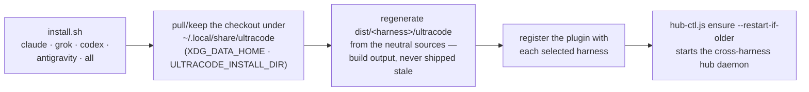

# Installation

The installer requires Git, Node 22.5+ for Ultracode's runtime hooks (the repo-memory store uses `node:sqlite`),
and the CLI for each selected harness.

## Quick local install

Install every harness:

```bash
curl -fsSL https://raw.githubusercontent.com/diepquynh/ultracode/main/install.sh | bash
```

Select one harness explicitly:

```bash
curl -fsSL https://raw.githubusercontent.com/diepquynh/ultracode/main/install.sh | bash -s -- claude
curl -fsSL https://raw.githubusercontent.com/diepquynh/ultracode/main/install.sh | bash -s -- grok
curl -fsSL https://raw.githubusercontent.com/diepquynh/ultracode/main/install.sh | bash -s -- codex
curl -fsSL https://raw.githubusercontent.com/diepquynh/ultracode/main/install.sh | bash -s -- antigravity
```

From a checkout, use `bash install.sh` for all harnesses or pass `claude`/`grok`/`codex`/`antigravity` for one. The script keeps
an updatable checkout under `${XDG_DATA_HOME:-$HOME/.local/share}/ultracode`; override it with
`ULTRACODE_INSTALL_DIR`. Pass `--dry-run` when running the local script to preview the workflow. `all` (the default) includes
Claude, Grok, Codex, and Antigravity.

What an install run does:



Each harness then needs one activation step before the hooks and skills are live:

| Harness | After install |
|---|---|
| Claude Code | Restart Claude Code. |
| Grok Build | Start a new session and run `/init-kit`. Grok trusts plugins under `~/.grok/plugins/` automatically; a project-local copy in `.grok/plugins/` needs `/hooks-trust` or `--trust` first. |
| Codex | Start a new session, open `/hooks`, and trust Ultracode's hooks; start one more session so they take effect. Codex intentionally does not trust plugin hooks automatically, so the model-routing and pipeline guard hooks remain inactive until then. |
| Antigravity | Restart `agy` or start a new session and run `/init-kit`. |

Grok also auto-loads Claude Code plugins. If Ultracode is already installed for Claude, skip the Grok target
or disable one copy so skills and hooks do not double-fire.

The installer also provisions and starts the **cross-harness hub** (docs/hub.md): one loopback HTTP daemon per
machine at `~/.ultracode`, started with `node <plugin>/mcp/hub-ctl.js ensure --restart-if-older`. If that step
warns, cross-harness tools stay offline until a session's MCP startup revives the hub (the registered
`ultracode-gate` server is `mcp/hub-shim.js`, which ensures the hub at boot) or you run the ctl command
yourself. Everything else — gate, report, memory — works without it. Set `ULTRACODE_HUB_DISABLE=1` in a
harness's environment to keep that machine or session daemon-free.

## Uninstall

Revert a matching `install.sh` run. The argument list is the same: omit it (or pass `all`) to unregister every
harness and remove the checkout; pass `claude`/`grok`/`codex`/`antigravity` to unregister one and leave the checkout for any
remaining targets. `ULTRACODE_INSTALL_DIR` must match the install.

```bash
curl -fsSL https://raw.githubusercontent.com/diepquynh/ultracode/main/uninstall.sh | bash
curl -fsSL https://raw.githubusercontent.com/diepquynh/ultracode/main/uninstall.sh | bash -s -- claude
curl -fsSL https://raw.githubusercontent.com/diepquynh/ultracode/main/uninstall.sh | bash -s -- grok
curl -fsSL https://raw.githubusercontent.com/diepquynh/ultracode/main/uninstall.sh | bash -s -- codex
curl -fsSL https://raw.githubusercontent.com/diepquynh/ultracode/main/uninstall.sh | bash -s -- antigravity
```

From a checkout, use `bash uninstall.sh`. Pass `--dry-run` to preview. Repo-local files from `/init-kit`
(`.ultracode` and the generated skills under each harness's skills dir) are not removed. A full (`all`)
uninstall also stops the cross-harness hub daemon but leaves `~/.ultracode` — the hub's bearer token and
queues — so a reinstall keeps working; delete that directory by hand to purge it.

## Claude Code manual install

Generate the distribution first — `dist/` is not committed — then add its root as a marketplace:

```bash
node scripts/generate_definitions.js --target claude
claude plugin marketplace add ./dist/claude/ultracode
claude plugin install ultracode@ultracode
```

Local marketplaces do not auto-update. After pulling and regenerating, run:

```bash
claude plugin marketplace update ultracode
claude plugin update ultracode@ultracode
```

For active development, regenerate and bypass installation for one session:

```bash
node scripts/generate_definitions.js --target claude
claude --plugin-dir /absolute/path/to/ultracode/dist/claude/ultracode
```

Published marketplaces use the same `claude plugin marketplace add <owner/repo-or-url>` and
`claude plugin install ultracode@<marketplace>` flow.

## Grok Build manual install

Generate the distribution first — `dist/` is not committed — then install it as a local plugin:

```bash
node scripts/generate_definitions.js --target grok
grok plugin validate ./dist/grok/ultracode
grok plugin install ./dist/grok/ultracode --trust
```

To browse it as a marketplace instead, add the generated plugin root (it carries
`.grok-plugin/marketplace.json` pointing at `.`) and install by name:

```bash
grok plugin marketplace add /absolute/path/to/ultracode/dist/grok/ultracode
grok plugin install ultracode --trust
```

For a one-session dry run without installing, pass `--plugin-dir`:

```bash
grok --plugin-dir /absolute/path/to/ultracode/dist/grok/ultracode
```

Confirm the load with `grok inspect`. Then run `/init-kit`.

## Codex manual install

Codex installs plugins from marketplaces and has no Claude-style `--plugin-dir` option. Generate the
distribution with `node scripts/generate_definitions.js --target codex`, then stage `dist/codex/ultracode`
beneath a local marketplace, with this manifest at `<marketplace>/.agents/plugins/marketplace.json`:

```json
{
  "name": "ultracode-local",
  "interface": {
    "displayName": "Ultracode Local"
  },
  "plugins": [
    {
      "name": "ultracode",
      "source": {
        "source": "local",
        "path": "./plugins/ultracode"
      },
      "policy": {
        "installation": "AVAILABLE",
        "authentication": "ON_INSTALL"
      },
      "category": "Productivity"
    }
  ]
}
```

Then configure and install it:

```bash
codex plugin marketplace add <marketplace>
codex plugin add ultracode@ultracode-local
```

For a published marketplace, replace the local marketplace path and name with the publisher's values. Codex
plugins work in the CLI and the Codex surface in the ChatGPT desktop app; the Codex IDE extension does not
currently load plugins.

## Antigravity CLI manual install

Generate the distribution first — `dist/` is not committed — then validate and install it via `agy`:

```bash
node scripts/generate_definitions.js --target antigravity
cd dist/antigravity/ultracode && npm ci --omit=dev --ignore-scripts
agy plugin validate dist/antigravity/ultracode
agy plugin install dist/antigravity/ultracode
agy plugin enable ultracode
```

Then start or restart `agy`, and run `/init-kit`.

