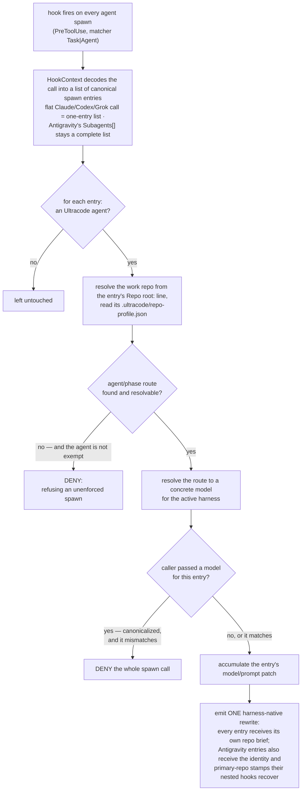

# Model routing

Ultracode decides which model runs each subagent, per repo, from a block you edit once. You don't say "use the
cheap one for this" in a prompt, and the orchestrator doesn't get to have an opinion about it — a hook applies
the route on every spawn and refuses the ones that don't match.

This is where the bill moves. Research, spec, and plan are a small fraction of a session's tokens and benefit
most from an expensive model; implementation is the bulk of the volume and, given a plan precise enough,
doesn't. Routing is what lets you spend accordingly without thinking about it again.

## Settings

Model settings lives in `.ultracode/repo-profile.json`, under `models`. Provided by `/init-kit` during repository initialization:

```json
"models": {
  "byAgent": {
    "explore": "advanced",
    "generate-spec": "advanced",
    "plan": "advanced",
    "fact-check": "advanced",
    "code-reviewer": "balanced",
    "execution-path-analyzer": "balanced",
    "module-documentation": "advanced",
    "prompt-generation": "advanced"
  },
  "byPhaseComplexity": {
    "implement":  { "low": "fast", "medium": "fast", "high": "balanced" },
    "write-test": { "low": "fast", "medium": "fast", "high": "balanced" }
  }
}
```

Routing mechanism works in 2 ways:
- Routing by agent - for a set of subagents that can have a single model running all the time.
- Routing by agent's complexity - for a set of subagents which can utilize the most efficient
model for execution, by its task complexity per phase.

The hook re-reads the file on every spawn, so an edit takes effect on the next one. No restart, no reload.

## Model naming

| Value | Definition |
| --- | --- |
| `"fast"` / `"balanced"` / `"advanced"` | A neutral tier, resolved to a concrete model for whichever harness is running. The normal case. |
| `"gpt-5.6-sol"` | A concrete model name. Names belonging to another harness's tier get translated (see below); anything else is passed through as written. |
| `{ "claude": "…", "codex": "…" }` | Pick the model per harness explicitly, with no translation. For when your backends don't line up with the tiers. |
| `"default"` | The tier baked into the agent's own definition. An explicit "I looked at this and the default is fine." |
| `"inherit"` | Leave the spawn's model alone — whatever the harness would have used, including a model the caller passed. |

`"default"` and `"inherit"` exist so that "I meant this" and "I forgot this" don't look identical. Once a
profile exists, a route that's simply missing is an error, not an invitation to guess.

## Tiering setup

`plan` writes a `**Complexity:** low`, `medium`, or `high` line into each phase file. The router reads that line
out of the phase file the spawn names and uses it as the key into `byPhaseComplexity`.

If there's no phase file — an inline fix with no plan behind it — the tier is `low`. That's deliberate: work
small enough to skip planning is work small enough for the cheap tier.

So a phase full of DTOs and config runs on `fast`, and the phase that touches the money runs on `balanced`,
without you classifying anything by hand. The planner already made that judgement at plan time, in writing,
where you saw it at the approval gate.

## Guardrails

The router denies rather than guessing. Roughly in the order you'll meet them:

**No route for an agent.**

```
ultracode: /repo/.ultracode/repo-profile.json has no model route for code-reviewer;
set a tier, "default", or "inherit" explicitly.
```

You added an agent, or hand-edited the block, or your profile predates an agent that now exists. Add the key.

**A caller passed a model that doesn't match.**

```
ultracode: spawn model "sonnet" does not match the routed model "opus" for plan.
Omit model, or re-spawn with model: opus — the profile owns this route and a caller
override is not applied.
```

The orchestrator is supposed to omit `model` entirely and let the hook fill it in. If you see this, re-spawn
with exactly the model the denial names, or nothing at all.

The obvious question is why this is a denial instead of a silent correction. Because a silent correction
doesn't hold: Grok treats a `model` the caller passed as an explicit user override and keeps it even after the
hook's `updatedInput` is applied. A rewrite would look like it worked and quietly bill you at the wrong tier —
so the spawn dies instead, loudly.

**A broken profile or an unresolvable route** — `repo-profile.json` isn't valid JSON, or a route's value is
empty, or a per-harness object has no entry for the harness you're on. All refused with "refusing an
unenforced spawn."

That phrase is the whole design in four words. A spawn that runs without a resolved route is a spawn whose cost
nobody chose, and those are exactly the ones that get expensive without anyone noticing.

## Exceptions

`initializer` and `fact-check` are the only agents a missing route doesn't kill.

`initializer` is spawned by `/init-kit`, not the orchestrator, and that command picks the model per mode. The
seeded profile deliberately carries no `initializer` key, so denying on a missing route would break every
re-initialization of an already-initialized repo. Add a key by hand if you want to override the per-mode
choice.

`fact-check` is exempt for a duller reason: it became a mandatory gate after some profiles were already
written. Without the exemption, every one of those repos would start hard-failing at spec approval until
someone re-ran `/init-kit`. Note that this affects *which model* runs it, never *whether* it runs — the
`ultracode_gate` tool refuses to record approval without a `PASS` regardless.

## What happens on a spawn



The final rewrite step is the surprise: the model router also writes part of the prompt. That's not scope creep, it's a
constraint. `PreToolUse` hooks don't compose — with two hooks on the same matcher, both see the *original* tool
input and exactly one hook's `updatedInput` survives; the other is discarded whole. So a second hook editing an
agent spawn would silently drop the routed model, and routing is deny-on-missing precisely because unenforced
spawns aren't acceptable. There's exactly one safe place to rewrite an agent spawn, and this is it. If you're
adding spawn-time behaviour, it goes in `model-router.js` too, however unrelated it feels.

## Cross-harness translation

Codex's `spawn_agent` schema accepts only lowercase letters, digits, and underscores. Generated Codex roles and
spawn instructions therefore use names prefixed `ultracode_` such as `ultracode_fact_check`; the harness
adapter normalizes those aliases back to canonical `fact-check` before routing and policy lookup. Claude/Grok
keep `ultracode:{agent}`, while Antigravity uses `ultracode-{agent}`.

**Codex is dynamically routed like everyone else — via the injected spawn argument, with the role TOMLs
kept model-free on purpose.** The chain, source-confirmed (2026-08-30, openai/codex@main): the v2
`spawn_agent` args struct carries `model` unconditionally (the `expose_spawn_agent_model_overrides`
feature flag only hides it from the tool schema, so a hook-injected key still parses), the handler applies
it with no feature gate (`apply_requested_spawn_agent_model_overrides`), and the role layer overwrites
`config.model` ONLY when the role file has one (`agent/role.rs build_next_config`). A role-file model
would override the argument unconditionally — which is why the generated TOMLs must never carry one; the
router (dispatch confirmed live 2026-08-30; re-trust in `/hooks` after matcher updates) injects the
resolved route as the spawn's `model` and pins `fork_turns: "none"` (codex treats an ABSENT fork_turns as
`"all"`). Two codex-specific caveats. First, the handler validates the injected name against codex's own
model list and fails the spawn on an unknown name — a route pointing at a custom gateway model codex has
never heard of breaks the spawn there, loudly. Second, a role with no model INHERITS the spawner's model
(measured — a sol orchestrator ran every leaf on sol), so if the hooks are not running (untrusted, stale
plugin cache), nothing re-routes and every leaf silently bills at the orchestrator's tier: on codex,
working hooks are what the routing economics stand on. With OpenAI models the spawn message itself is
end-to-end encrypted, so the router never touches the prompt on codex — the repo brief would corrupt the
ciphertext; contract enforcement runs through `ultracode_spawn_ticket` instead (see
harness-limitations.md).

**Grok Build routes the same way** (source-confirmed 2026-08-30, xai-org/grok-build@main): the spawn tool's
input has a first-class `model` slug field, the router's `updatedInput` rewrite carries it, and the generated
agent files stay model-free so the definition never outranks the profile. Two grok caveats mirror codex's.
First, a `TaskModelValidator` checks the slug before spawn, so a route naming a model grok doesn't serve
fails the spawn loudly. Second, grok schema-validates every hook rewrite and *blocks the call* on an
unusable one — which is why the router's patch must add nothing beyond what `TaskToolInput` declares (no
`fork_turns` on grok), and why the rewrite lives only in `hookSpecificOutput.updatedInput`. As on codex, if
the hooks are not running, a model-less spawn inherits the parent's model and nothing re-routes.

The generated routing table carries the tier→model map for the harness it was built for, plus aliases from
every *other* harness's model names to the local equivalent. Write `"opus"` in a profile and run it on Codex,
and you get that harness's advanced model. A name that belongs to no tier is passed through untouched, so
pointing a route at something the mapping has never heard of still works.

This matters because the profile is a committed file. One repo, one `models` block, a team split across Claude
Code and Codex — and nobody has to maintain two copies.

## Initialization

On a repo that hasn't been initialized, every agent falls back to the default tier from its own definition.
That's what makes `/init-kit` able to run at all on a fresh checkout. The strictness only switches on once
there's a profile to be strict about.

## Limitations

`effort` isn't routable. It's a subagent-definition field — there's no per-invocation `effort` argument on the
spawn tool, and no environment variable for it — so Claude and Grok carry it in agent front matter and Codex as
`model_reasoning_effort` in the role TOML, and whatever is written there holds no matter which tier the router
picks. Changing it means editing the definition and regenerating.

Relatedly: the generated agent files omit `model` on Codex and Grok on purpose. A role-level model setting
outranks the spawn argument on those harnesses, which would hand the definition a decision the profile is
supposed to own. Claude agents keep their front-matter default, and that's what the router falls back to when a
route says `"default"` or there's no profile at all.

## Choosing your own tiers

The defaults are a starting point, not a recommendation for your setup. The block is per-repo and per-agent
because not everyone is running Anthropic-hosted models — a tier can point at a gateway, a proxy, Bedrock,
Vertex, or whatever else you actually serve, and the right answer depends on what that costs you.

[Tested models](tested-models.md) is the field notes — what each model was actually like in each role, from
real sessions rather than a leaderboard. Start there, then tune the block against your own bill.
